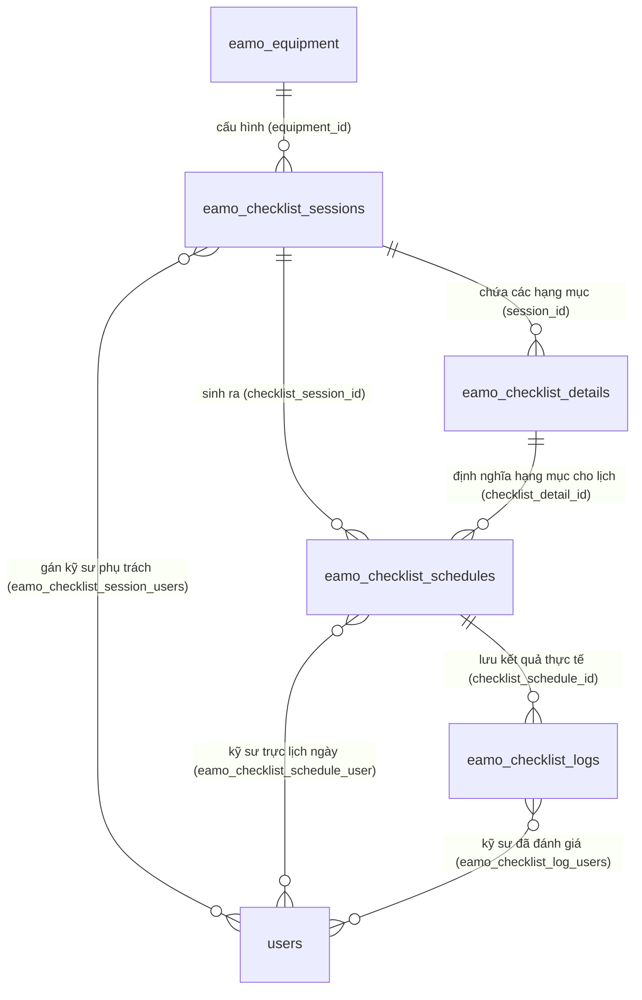

# Phân Tích Logic Thêm Checklist & Tự Động Sinh Hạng Mục Chi Tiết + Lịch Trình (Checklist Schedules)

Tài liệu này phân tích chi tiết thiết kế cơ sở dữ liệu, luồng nghiệp vụ khi cấu hình checklist, logic tự động sinh lịch kiểm tra (Schedules & Logs) thông qua dịch vụ `ChecklistScheduleGeneratorService`, cơ chế bảo vệ dữ liệu đã thực hiện, và hướng dẫn chạy kiểm thử (Unit Test) trực tiếp trên máy local.

---

## 1. Mối Quan Hệ Giữa Các Bảng (Database Architecture & Relations)

Hệ thống quản lý checklist hoạt động dựa trên các bảng chính sau:

### 1.1. Chi tiết các bảng dữ liệu
1. **`eamo_checklist_sessions` (`ChecklistSession`):**
   - Đóng vai trò là **Template/Cấu hình mẫu** checklist cho một thiết bị cụ thể (`equipment_id`).
   - Lưu trữ chu kỳ kiểm tra: loại chu kỳ (`cycle_type`: `daily`, `weekly`, `monthly`, `yearly`) và khoảng thời gian lặp (`cycle_interval`).
   - Lưu ngày kết thúc hiệu lực của chu kỳ cấu hình (`session_date`).
2. **`eamo_checklist_details` (`ChecklistDetail`):**
   - Lưu trữ các **Hạng mục kiểm tra chi tiết** cụ thể (ví dụ: *"Kiểm tra mức dầu"*, *"Vệ sinh lưới lọc"*) thuộc về một Session mẫu (`session_id`).
3. **`eamo_checklist_schedules` (`ChecklistSchedule`):**
   - Lưu trữ **Lịch trình kiểm tra thực tế** của từng hạng mục chi tiết (`checklist_detail_id`) theo từng ngày cụ thể (`date`).
   - Chứa thông tin về việc dời lịch: `is_rescheduled` (đã dời lịch thủ công) và `original_date` (ngày được xếp lịch ban đầu).
4. **`eamo_checklist_logs` (`ChecklistLog`):**
   - Ghi lại **Kết quả kiểm tra thực tế** của một lịch trình cụ thể (`checklist_schedule_id`).
   - Trạng thái kiểm tra: `status` (`pending` - đang chờ / `completed` - đã hoàn thành).
   - Kết quả đánh giá: `result` (`pass` - đạt / `fail` - không đạt / `null` - chưa đánh giá).
   - Lưu vết thời điểm kiểm tra (`checked_at`).
5. **`eamo_equipment` (`Equipment`):**
   - Bảng thiết bị được kiểm tra.
6. **`users` (`User`):**
   - Kỹ sư/nhân viên vận hành tham gia chịu trách nhiệm hoặc kiểm tra thực tế.

### 1.2. Mối quan hệ giữa các bảng qua bảng pivot
- **Gán kỹ sư phụ trách Session:** Quan hệ Nhiều-Nhiều giữa `eamo_checklist_sessions` và `users` thông qua bảng pivot **`eamo_checklist_session_users`**.
- **Gán kỹ sư phụ trách Lịch trình cụ thể:** Quan hệ Nhiều-Nhiều giữa `eamo_checklist_schedules` và `users` thông qua bảng pivot **`eamo_checklist_schedule_user`**.
- **Kỹ sư thực hiện đánh giá thực tế:** Quan hệ Nhiều-Nhiều giữa `eamo_checklist_logs` và `users` thông qua bảng pivot **`eamo_checklist_log_users`**.

### 1.3. Sơ đồ Quan hệ Thực thể (ERD)



---

## 2. Phân Tích Logic Thêm & Cập Nhật Cấu Hình Checklist

### 2.1. Quy trình Thêm Mới Checklist (`StoreChecklistSessionService`)
Khi người dùng tạo cấu hình checklist lần đầu cho một thiết bị trên giao diện:
1. Yêu cầu `POST /api/v1/checklist-sessions` được định tuyến đến **`StoreChecklistSessionService`**.
2. **Giao dịch Database (DB Transaction):** Toàn bộ tiến trình chạy trong một transaction để đảm bảo tính toàn vẹn dữ liệu.
3. **Tạo Session Template:** Tạo bản ghi trong `eamo_checklist_sessions`.
4. **Đồng bộ kỹ sư phụ trách:** Lưu thông tin pivot `eamo_checklist_session_users` và gửi thông báo hệ thống nếu có `user_ids`.
5. **Tạo các Hạng mục chi tiết:** Chạy vòng lặp qua mảng `details` truyền lên từ request để tạo các bản ghi `ChecklistDetail` liên kết với Session vừa tạo.
6. **Kích hoạt tự động sinh lịch:** Gọi hàm `regenerateForSession` của `ChecklistScheduleGeneratorService` để sinh lịch kiểm tra cho từng hạng mục theo các ngày tương ứng trong chu kỳ.

### 2.2. Quy trình Cập Nhật Cấu Hình Checklist (`ChecklistSessionUpdateService`)
Khi người dùng sửa cấu hình checklist (như thay đổi chu kỳ lặp, đổi ngày kết thúc, thêm/bớt hạng mục chi tiết):
1. Yêu cầu `PUT /api/v1/checklist-sessions/{id}` gọi đến **`ChecklistSessionUpdateService`**.
2. **Cập nhật Session Template:** Cập nhật thông tin cơ bản (`name`, `cycle_type`, `cycle_interval`, `session_date`).
3. **Đồng bộ lại kỹ sư phụ trách:** Cập nhật bảng pivot nếu danh sách kỹ sư thay đổi.
4. **Áp dụng dọn dẹp & sinh lại lịch trình:**
   - Nếu checklist chạy theo chu kỳ tuần hoàn (có `cycle_type` và `cycle_interval`), hệ thống sẽ gọi `regenerateForSession` để tự động tính toán lại lịch bắt đầu từ hôm nay (`CarbonImmutable::today()`) cho đến ngày kết thúc `session_date`.
   - Nếu là cấu hình kiểm tra một lần (không lặp tuần hoàn), hệ thống sẽ di dời các lịch kiểm tra chưa thực hiện sang ngày mới hoặc đồng bộ thủ công qua `syncManualSchedules`.

---

## 3. Phân Tích Logic Tự Động Sinh Lịch Trình (`ChecklistScheduleGeneratorService`)

Lớp `ChecklistScheduleGeneratorService` chịu trách nhiệm cốt lõi trong thuật toán tính toán ngày và sinh lịch.

### 3.1. Tính toán danh sách ngày kiểm tra (`generateDates`)
Hàm này nhận vào ngày bắt đầu (`startDate`), ngày kết thúc (`endDate`), loại chu kỳ (`cycle_type`), và khoảng lặp (`cycle_interval`). Nó trả về danh sách các đối tượng `CarbonImmutable` đại diện cho các ngày cần thực hiện kiểm tra:
```php
public function generateDates(
    CarbonImmutable $startDate,
    CarbonImmutable $endDate,
    string $cycleType,
    int $cycleInterval
): array {
    $dates = [];
    $currentDate = $startDate;

    while ($currentDate->lessThanOrEqualTo($endDate)) {
        $dates[] = $currentDate;
        $currentDate = match ($cycleType) {
            'daily' => $currentDate->addDays($cycleInterval),
            'weekly' => $currentDate->addWeeks($cycleInterval),
            'monthly' => $currentDate->addMonths($cycleInterval),
            'yearly' => $currentDate->addYears($cycleInterval),
            default => throw new \InvalidArgumentException("Invalid cycle type: {$cycleType}"),
        };
    }

    return $dates;
}
```

### 3.2. Giới hạn số lượng lịch kiểm tra tối đa (`MAX_SCHEDULES = 100`)
Để bảo vệ hệ thống khỏi việc người dùng vô tình tạo chu kỳ quá ngắn và khoảng thời gian quá dài gây tràn bộ nhớ (ví dụ: chu kỳ lặp hàng ngày kéo dài 10 năm), hệ thống đặt giới hạn:
$$\text{Tổng số lượng lịch trình} = \text{Số lượng ngày tính được} \times \text{Số lượng hạng mục chi tiết}$$
Nếu tích này vượt quá $100$ (`self::MAX_SCHEDULES`), hệ thống sẽ lập tức ném ra lỗi `ValidationException` để yêu cầu người dùng thu hẹp khoảng thời gian hoặc giảm bớt hạng mục.

### 3.3. Cơ chế Bảo vệ Lịch trình cũ khi sinh lại lịch (`regenerateForSession`)
Khi cấu hình checklist bị thay đổi và cần cập nhật lại lịch trình, hệ thống **không xóa toàn bộ** để tránh mất dữ liệu thực tế lịch sử. Cơ chế được triển khai qua các bước:

1. **Thu thập danh sách Lịch trình được bảo vệ (Protected):**
   Gọi hàm `getProtectedScheduleIds` để lọc ra các ID lịch trình thoả mãn:
   - Đã được kỹ sư hoàn thành thực hiện kiểm tra (`ChecklistLog` liên kết có `status = 'completed'`).
   - Đã bị dời lịch thủ công (`is_rescheduled = true`) do người quản lý sắp xếp lại ngày kiểm tra cụ thể của hạng mục đó.
   
2. **Dọn dẹp lịch trình không được bảo vệ (Unprotected):**
   Xóa toàn bộ các bản ghi `ChecklistSchedule` nằm trong khoảng ngày cấu hình, liên kết với Session, thuộc thiết bị tương ứng nhưng **không** nằm trong danh sách được bảo vệ bên trên. Việc xóa được thực thi an toàn thông qua soft delete (`cascadeService->deleteChecklistSchedules`).

3. **Sinh bổ sung lịch trình thiếu:**
   Hệ thống duyệt qua tất cả các ngày tính toán được và tất cả các hạng mục `ChecklistDetail` hiện tại.
   Nếu chưa tồn tại lịch trình cho ngày đó và hạng mục đó (xét cả ngày thực tế `date` và ngày ban đầu `original_date`), hệ thống sẽ tiến hành tạo mới:
   - Tạo bản ghi **`ChecklistSchedule`** mới.
   - Gọi `createPendingLog` để tạo mặc định 1 bản ghi **`ChecklistLog`** ở trạng thái `pending` (chờ đánh giá) liên kết với lịch trình đó.
   - Đồng bộ danh sách kỹ sư chịu trách nhiệm thực hiện và kích hoạt gửi thông báo.

---

## 4. Hướng Dẫn Chạy Kiểm Thử (Unit Test) trên máy Local

Bộ kiểm thử tự động (Unit Test) cho tính năng sinh ngày theo chu kỳ của `ChecklistScheduleGeneratorService` đã được xây dựng và xác thực bằng **Pest PHP**.

### 4.1. Thiết lập cấu hình kiểm thử độc lập
Để đảm bảo bộ kiểm thử có thể chạy mượt mà trên môi trường local của kỹ sư phát triển mà không bị lỗi thiếu driver cơ sở dữ liệu SQLite trong memory, file cấu hình `tests/Pest.php` đã được tối ưu hóa:
- Thư mục `tests/Unit` kế thừa lớp `TestCase` chuẩn của Laravel giúp kích hoạt đầy đủ Service Container và nạp các Class/Service.
- Không sử dụng trait `RefreshDatabase` trong các kiểm thử Unit tính toán đơn thuần để tăng tốc độ thực thi và loại bỏ sự phụ thuộc vào driver SQLite của database thực tế.

### 4.2. Lệnh thực hiện chạy kiểm thử
Mở terminal (như PowerShell hoặc CMD) tại thư mục gốc của backend (`eamo-backend`) và chạy lệnh sau để lọc và chạy riêng bộ test cho Generator:

```powershell
php artisan test --filter=ChecklistScheduleGeneratorTest
```

### 4.3. Kết quả chạy thực tế thành công
```bash
PASS  Tests\Unit\ChecklistScheduleGeneratorTest
✓ generateDates daily cycle works correctly
✓ generateDates weekly cycle works correctly
✓ generateDates monthly cycle with interval 2 works correctly
✓ generateDates throws exception for invalid cycle type

Tests:    4 passed (16 assertions)
Duration: 4.43s
```

- **Số lượng test case:** 4 cases (Bao gồm test sinh ngày theo chu kỳ Ngày, Tuần, Tháng với khoảng lặp tùy biến, và test ném ngoại lệ khi chu kỳ không hợp lệ).
- **Số lượng khẳng định (Assertions):** 16 assertions.
- **Trạng thái:** Toàn bộ kiểm thử đều vượt qua thành công (`passed`), đảm bảo thuật toán sinh lịch hoạt động chính xác tuyệt đối.
