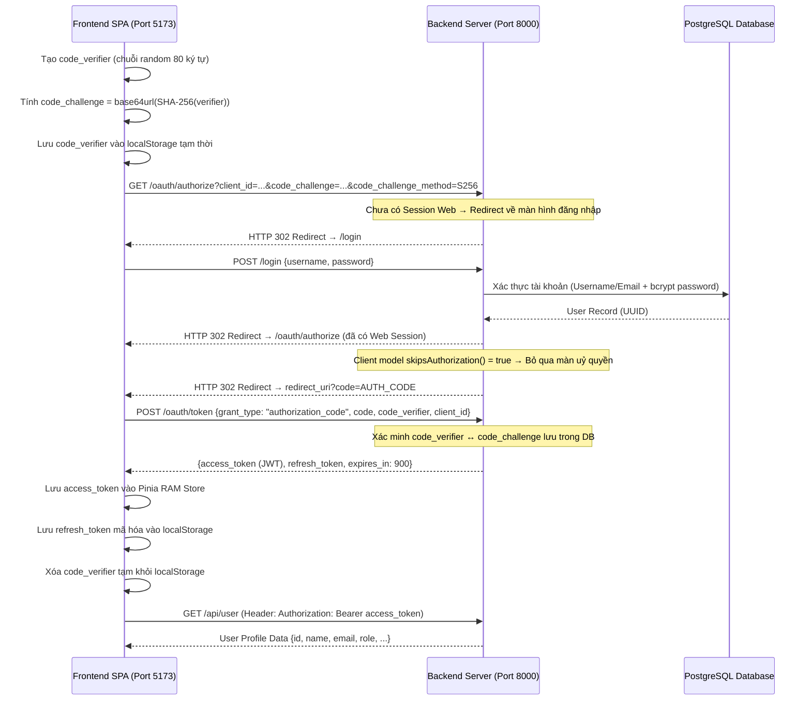
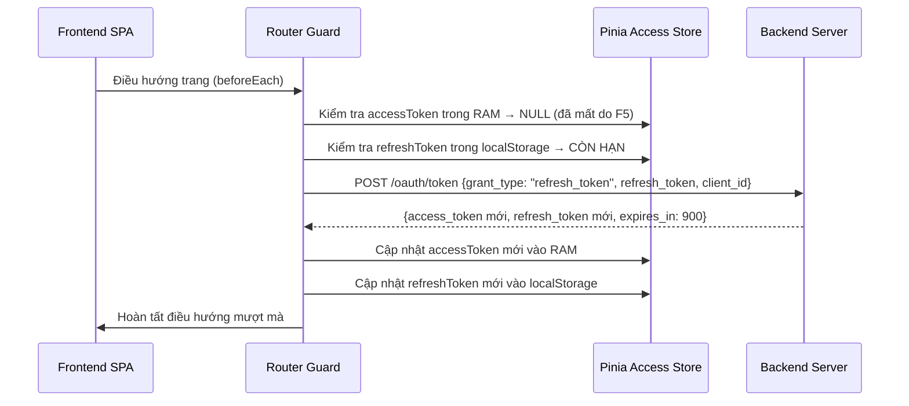
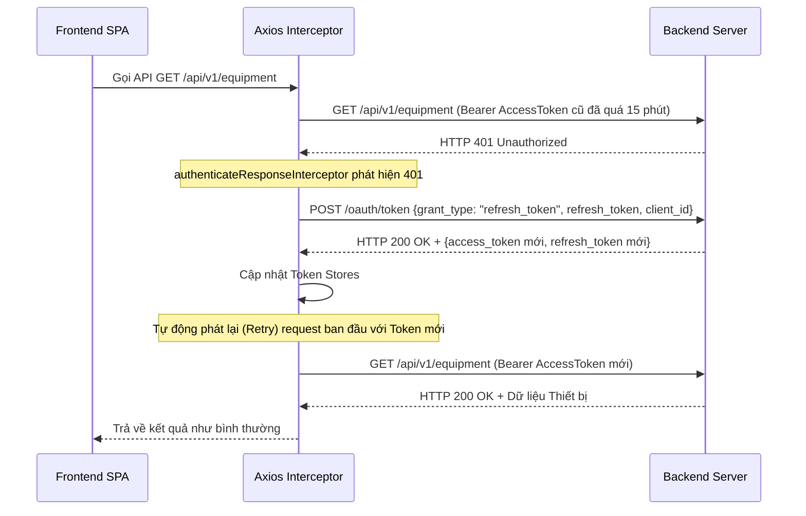

# Tài liệu Luồng Xác thực OAuth 2.0 PKCE & Phân Quyền (JWT + Roles)

Dự án EAMO Backend sử dụng **Laravel Passport v13** triển khai luồng **OAuth 2.0 Authorization Code với PKCE (Proof Key for Code Exchange)** cho ứng dụng SPA Frontend. Cơ chế PKCE loại bỏ hoàn toàn nhu cầu lưu trữ `client_secret` ở phía Client, đồng thời hệ thống hỗ trợ **tự động làm mới access token (silent refresh)** và nhúng trực tiếp **vai trò (roles)** vào JWT Payload.

---

## 1. Chiến lược Quản lý Token (Token Strategy)

| Loại Token | Thời hạn hiệu lực | Nơi lưu trữ ở Frontend | Mục đích sử dụng |
|---|---|---|---|
| **Access Token** | 15 phút | RAM (Pinia Store - không persist) | Gửi kèm header `Authorization: Bearer <token>` mỗi API Request |
| **Refresh Token** | 30 ngày | `localStorage` (Encrypted) | Lấy Access Token mới khi cũ bị hết hạn |
| **Personal Access Token** | 6 tháng | Database (`oauth_access_tokens`) | Dùng cho tích hợp API bên ngoài (nếu có) |

### Lý do thiết kế & Cơ chế bảo mật:
1. **Access Token ngắn hạn (15 phút) lưu trong RAM**: Triệt tiêu rủi ro bị đánh cắp token qua các cuộc tấn công XSS.
2. **Refresh Token dài hạn (30 ngày) lưu encrypted trong localStorage**: Tồn tại qua các thao tác F5 / đóng mở trình duyệt, cho phép **Silent Refresh** tự động duy trì phiên đăng nhập mà người dùng không hề hay biết.
3. **Xoay vòng Refresh Token (Token Rotation)**: Mỗi lần dùng Refresh Token để lấy Access Token mới, Backend thu hồi Refresh Token cũ và phát hành một Refresh Token hoàn toàn mới.

---

## 2. Biểu đồ Sequence Diagram các Luồng Xác thực

### 2.1. Đăng nhập lần đầu (Authorization Code + PKCE)



### 2.2. Silent Refresh khi F5 hoặc mở Tab mới



### 2.3. Tự động Refresh khi Access Token hết hạn giữa chừng (Axios Interceptor)



---

## 3. Cấu hình & Tùy chỉnh Kỹ thuật trên Backend

### 3.1. Cấu hình Thời hạn Token (`AppServiceProvider.php`)

Nằm tại [`app/Providers/AppServiceProvider.php`](file:///c:/Users/khanh/Projects/eamo/backend/app/Providers/AppServiceProvider.php):

```php
use Laravel\Passport\Passport;

public function boot(): void
{
    Passport::tokensExpireIn(now()->addMinutes(15));       // Access Token: 15 phút
    Passport::refreshTokensExpireIn(now()->addDays(30));   // Refresh Token: 30 ngày
    Passport::personalAccessTokensExpireIn(now()->addMonths(6));
}
```

### 3.2. Nhúng Roles vào JWT Payload (`Bridge/AccessToken.php`)

Ứng dụng tùy biến lớp Bridge Passport tại [`app/Bridge/AccessToken.php`](file:///c:/Users/khanh/Projects/eamo/backend/app/Bridge/AccessToken.php) để tự động bổ sung claim `roles` vào JWT Payload. Nhờ đó, Client chỉ cần parse JWT là có ngay thông tin phân quyền mà không cần gọi lại API:

```php
public function convertToJWT()
{
    // Lấy thông tin user và gán roles vào JWT Claim
    $user = User::find($this->getUserIdentifier());
    $roles = $user ? [$user->role] : [];

    $builder = $this->initJwtConfiguration()
        ->builder()
        ->permittedFor($this->getClient()->getIdentifier())
        ->identifiedBy($this->getIdentifier())
        ->issuedAt(new DateTimeImmutable())
        ->canOnlyBeUsedAfter(new DateTimeImmutable())
        ->expiresAt($this->getExpiryDateTime())
        ->relatedTo((string) $this->getUserIdentifier())
        ->withClaim('scopes', $this->getScopes())
        ->withClaim('roles', $roles); // Inject roles claim

    return $builder->getToken($this->jwtConfiguration->signer(), $this->jwtConfiguration->signingKey());
}
```

Đồng thời đăng ký Repository custom tại [`AppServiceProvider.php`](file:///c:/Users/khanh/Projects/eamo/backend/app/Providers/AppServiceProvider.php):

```php
$this->app->singleton(
    AccessTokenRepositoryInterface::class,
    fn ($app) => new AccessTokenRepository(
        $app->make(TokenRepository::class),
        $app->make(Dispatcher::class)
    )
);
```

### 3.3. Tự động Bỏ qua Màn hình Ủy quyền Client (`Models/OAuth/Client.php`)

Do SPA Frontend là ứng dụng nội bộ tin cậy, màn hình hỏi cấp quyền ("Authorize Application") được bỏ qua tại [`app/Models/OAuth/Client.php`](file:///c:/Users/khanh/Projects/eamo/backend/app/Models/OAuth/Client.php):

```php
public function skipsAuthorization(Authenticatable $user, array $scopes): bool
{
    return true;
}
```

### 3.4. Hệ thống Middleware Phân Quyền Access Level

Backend định nghĩa các Middleware phân quyền trong ứng dụng:
- **`auth:api`**: Yêu cầu Bearer Access Token hợp lệ.
- **`own.user`**: Kiểm tra user thao tác chính chủ trên tài khoản của họ.
- **`admin`**: Kiểm tra user có vai trò `admin`.
- **`manager`**: Kiểm tra user có vai trò `manager` hoặc `admin`.
- **`engineer`**: Kiểm tra user có vai trò `engineer`, `manager` hoặc `admin` (cho phép các kỹ sư đọc & thực hiện công việc).

---

## 4. Bảng Chi Tiết API Xác Thực

| Endpoint | Method | Middleware | Nội dung / Parameter | Response |
|---|---|---|---|---|
| `/oauth/authorize` | GET | `web` | `client_id`, `redirect_uri`, `response_type=code`, `code_challenge`, `code_challenge_method=S256` | HTTP 302 Redirect |
| `/login` | POST | `web` | `{ "username": "...", "password": "..." }` | HTTP 302 Redirect / Session |
| `/oauth/token` | POST | None | Grant `authorization_code` hoặc `refresh_token` | `{ "access_token": "...", "refresh_token": "...", "expires_in": 900 }` |
| `/api/user` | GET | `auth:api`, `own.user` | Bearer Token | User Profile Resource |
| `/api/user` | PUT | `auth:api`, `own.user` | `{ "name": "...", "email": "...", ... }` | Updated User Resource |
| `/api/logout` | POST | `auth:api`, `own.user` | Bearer Token | HTTP 200/204 |
