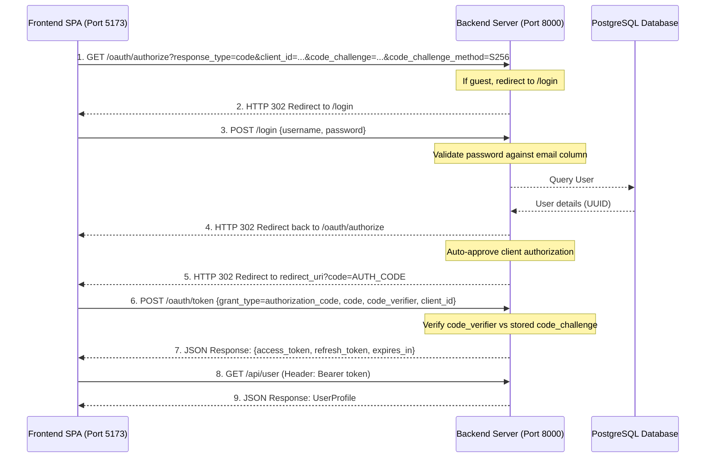

# OAuth 2.0 PKCE Authentication flow

This project uses **Laravel Passport 13.x** to implement the secure OAuth 2.0 authorization code flow with Proof Key for Code Exchange (PKCE) for Single Page Applications (SPAs) and mobile clients. 

PKCE bypasses the need for client secrets on public clients, preventing token interception attacks.

---

## 1. Flow Diagram



---

## 2. Setup & Configuration

### Custom OAuth Client Model (`App\Models\OAuth\Client`)
By default, Passport prompts the user to grant permission to the client. Since the frontend client is a trusted first-party application, we bypass this screen.
We override the `skipsAuthorization` method in our custom client class:
- **File**: `app/Models/OAuth/Client.php`
- **Method**:
  ```php
  public function skipsAuthorization(Authenticatable $user, array $scopes): bool
  {
      return true; // Bypass the consent authorization view
  }
  ```
Registered in `AppServiceProvider.php` via:
```php
Passport::useClientModel(\App\Models\OAuth\Client::class);
```

### UUID Keys Configuration
The `users` table uses UUID values as primary keys. Consequently, all Passport database structures have been migrated to support UUID identifiers:
- `oauth_auth_codes.user_id` -> `UUID`
- `oauth_access_tokens.user_id` -> `UUID`
- `oauth_device_codes.user_id` -> `UUID`
- `oauth_clients.owner_id` -> `UUID` (`nullableUuidMorphs`)
- `sessions.user_id` -> `UUID` (so standard Web guard session tracking does not crash when storing user UUIDs)

### CORS (Cross-Origin Resource Sharing)
Since the frontend SPA requests tokens directly from `/oauth/token` (different port), CORS must be allowed for these routes.
- **File**: `config/cors.php`
- **Configuration**:
  ```php
  'paths' => ['api/*', 'oauth/*', 'sanctum/csrf-cookie'],
  'allowed_origins' => ['http://localhost:5173', 'http://127.0.0.1:5173'],
  'supports_credentials' => true,
  ```

---

## 3. Key Files & Responsibilities

| File / Component | Responsibility |
|---|---|
| [`config/auth.php`](../config/auth.php) | Defines authentication guards. `web` guard uses `session` driver, while `api` guard uses `passport` driver. |
| [`app/Providers/AppServiceProvider.php`](../app/Providers/AppServiceProvider.php) | Bootstraps Passport token durations and binds the custom `Client` model. |
| [`app/Http/Requests/Auth/LoginRequest.php`](../app/Http/Requests/Auth/LoginRequest.php) | Validates credentials during `/login` POST requests, mapping the `username` field to the database `email` column. |
| [`app/Models/User.php`](../app/Models/User.php) | Uses `HasApiTokens` and `HasUuids` traits to support UUID auto-generation and Passport token retrieval. |
| [`routes/auth.php`](../routes/auth.php) | Registers minimal Web authentication endpoints (`login` GET/POST and `logout` POST). |
| [`routes/api.php`](../routes/api.php) | Exposes the protected `/api/user` profile route using the `auth:api` middleware. |

---

## 4. API Reference

### 1. Request Authorization Code
- **Method / URL**: `GET /oauth/authorize`
- **Query Parameters**:
  - `client_id`: UUID of the public client.
  - `redirect_uri`: Target callback URL (must match redirect URIs in `oauth_clients` database).
  - `response_type`: `code`
  - `code_challenge`: SHA-256 base64url encoded challenge string.
  - `code_challenge_method`: `S256`
- **Output**: Redirects to `redirect_uri` with a `code` query parameter upon successful login.

### 2. Request Access Token
- **Method / URL**: `POST /oauth/token`
- **Headers**:
  - `Content-Type: application/json`
  - `Accept: application/json`
- **Request Body**:
  - `grant_type`: `authorization_code`
  - `client_id`: UUID of the client.
  - `redirect_uri`: Target callback URL.
  - `code_verifier`: Plain text verification string matching the challenge.
  - `code`: The authorization code received in the redirect.
- **Output**: JSON access/refresh token packet.

### 3. Fetch Logged-In User Details
- **Method / URL**: `GET /api/user`
- **Headers**:
  - `Authorization: Bearer <ACCESS_TOKEN>`
  - `Accept: application/json`
- **Output**: JSON payload of the authenticated user's model attributes.

### 4. Revoke Access Token (Logout)
- **Method / URL**: `POST /api/logout`
- **Headers**:
  - `Authorization: Bearer <ACCESS_TOKEN>`
  - `Accept: application/json`
- **Output**: HTTP 204 No Content response upon successful token revocation.
