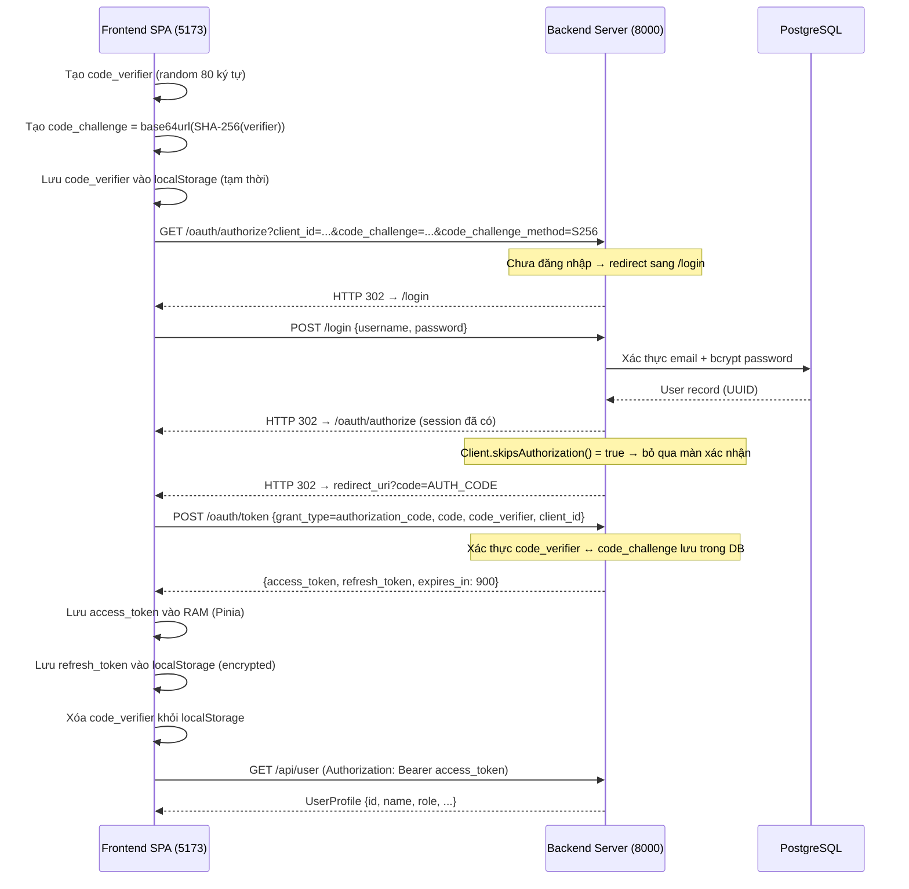
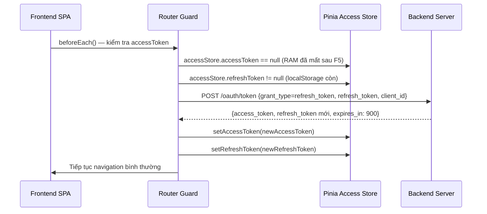
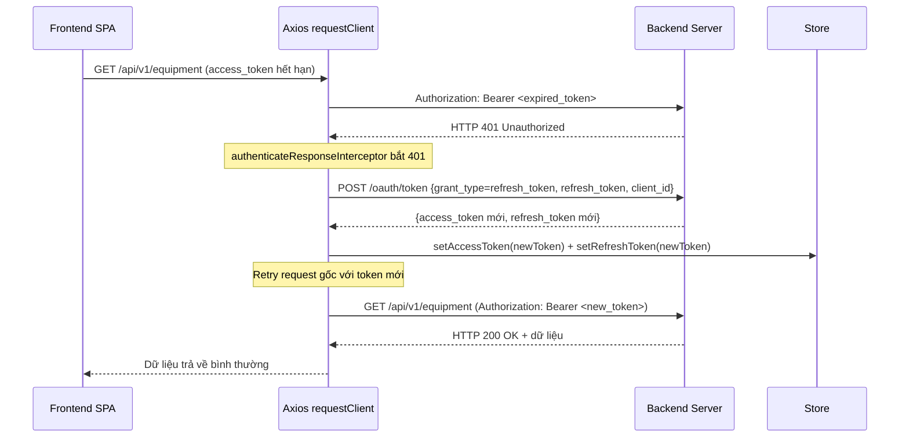
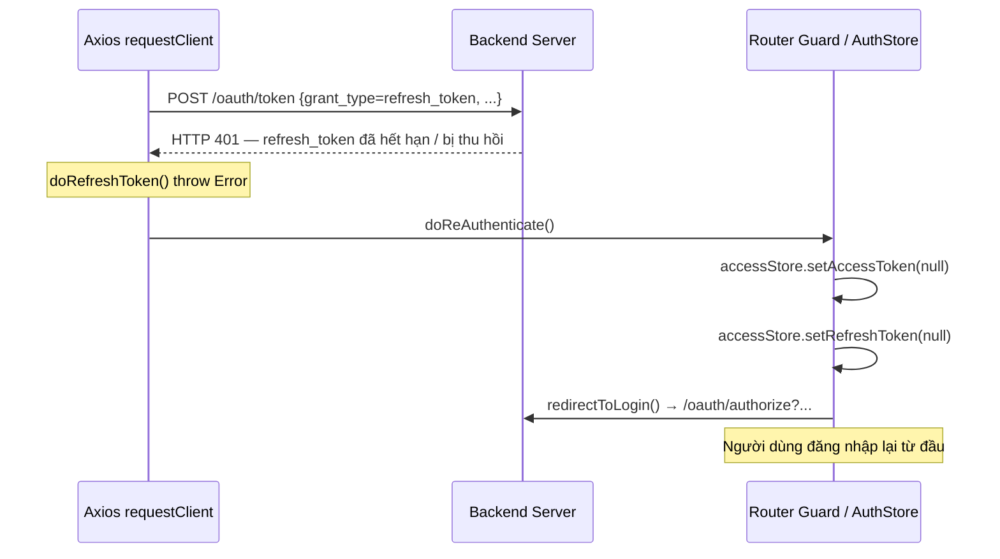

# Tài liệu Luồng Xác thực OAuth 2.0 PKCE + Auto Refresh Token

Dự án sử dụng Laravel Passport v13 để triển khai luồng **OAuth 2.0 Authorization Code + PKCE** cho SPA frontend. Cơ chế PKCE loại bỏ `client_secret` trên các ứng dụng public, đồng thời hệ thống hỗ trợ **tự động làm mới access token** (silent refresh) để người dùng không cần đăng nhập lại trong suốt phiên làm việc.

---

## 1. Chiến lược Token

| Loại Token     | Thời hạn | Nơi lưu trữ                          | Mục đích                              |
|----------------|----------|---------------------------------------|---------------------------------------|
| Access Token   | 15 phút  | RAM (Pinia store, không persist)      | Gửi kèm `Authorization: Bearer` mỗi request |
| Refresh Token  | 30 ngày  | `localStorage` (encrypted)           | Lấy Access Token mới khi hết hạn     |

**Lý do thiết kế:**
- Access Token lưu trong RAM → không bị đánh cắp qua XSS từ localStorage.
- Refresh Token lưu encrypted trong localStorage → tồn tại qua F5 / đóng tab, cho phép silent refresh mà không cần đăng nhập lại.
- Refresh Token xoay vòng (rotate) mỗi lần dùng → giảm thiểu rủi ro token bị replay.

---

## 2. Biểu đồ Luồng

### 2.1 Đăng nhập lần đầu (Authorization Code + PKCE)



### 2.2 Silent Refresh sau khi F5 / mở tab mới



### 2.3 Auto Refresh khi Access Token hết hạn giữa chừng (Axios Interceptor)



### 2.4 Refresh Token hết hạn → Buộc đăng nhập lại



---

## 3. Cấu hình Hệ thống

### 3.1 Thời hạn Token — Backend

**Tệp tin**: [`app/Providers/AppServiceProvider.php`](../app/Providers/AppServiceProvider.php)

```php
Passport::tokensExpireIn(now()->addMinutes(15));       // Access Token: 15 phút
Passport::refreshTokensExpireIn(now()->addDays(30));   // Refresh Token: 30 ngày
Passport::personalAccessTokensExpireIn(now()->addMonths(6));
```

### 3.2 Response Interceptor — Frontend

**Tệp tin**: [`src/api/request.ts`](../../frontend/src/api/request.ts)

Backend trả về định dạng `{ "status": "success", "data": {...} }`, không có field `code`. Interceptor được viết custom để khớp đúng format này:

```typescript
client.addResponseInterceptor({
  fulfilled: (response) => {
    const { config, data, status } = response;
    if (config.responseReturn === 'raw') return response;
    if (status >= 200 && status < 400) {
      if (config.responseReturn === 'body') return data;
      // Unwrap { status, data } → trả về data.data
      if (data && typeof data === 'object' && 'data' in data) {
        return data.data;
      }
      return data;
    }
    throw Object.assign({}, response, { response });
  },
});
```

Sau đó, `authenticateResponseInterceptor` được cấu hình với `enableRefreshToken: true` để tự động gọi `doRefreshToken()` khi nhận 401:

```typescript
client.addResponseInterceptor(
  authenticateResponseInterceptor({
    client,
    doReAuthenticate,
    doRefreshToken,   // POST /oauth/token grant_type=refresh_token
    enableRefreshToken: true,
    formatToken,
  }),
);
```

### 3.3 Silent Refresh tại Router Guard — Frontend

**Tệp tin**: [`src/router/guard.ts`](../../frontend/src/router/guard.ts)

Khi người dùng F5 hoặc mở tab mới, access token (RAM) bị mất nhưng refresh token (localStorage) vẫn còn. Guard sẽ tự động thực hiện silent refresh trước khi điều hướng:

```typescript
if (!accessStore.accessToken && accessStore.refreshToken) {
  try {
    const result = await refreshAccessToken(accessStore.refreshToken);
    accessStore.setAccessToken(result.accessToken);
    if (result.refreshToken) accessStore.setRefreshToken(result.refreshToken);
  } catch {
    accessStore.setRefreshToken(null); // Hết hạn → xóa
  }
}
```

### 3.4 Tự động Duyệt Ủy quyền (Custom Client Model)

**Tệp tin**: [`app/Models/OAuth/Client.php`](../app/Models/OAuth/Client.php)

Frontend là ứng dụng nội bộ tin cậy, màn hình xác nhận cấp quyền được bỏ qua:

```php
public function skipsAuthorization(Authenticatable $user, array $scopes): bool
{
    return true;
}
```

### 3.5 Role Claims trong JWT

**Tệp tin**: [`app/Bridge/AccessToken.php`](../app/Bridge/AccessToken.php)

Thông tin role được chèn vào JWT payload để frontend phân quyền mà không cần gọi thêm API:

```php
// JWT payload sẽ chứa thêm:
// "roles": ["admin"] | ["manager"] | ["engineer"] | ["operator"]
```

Cấu hình tại [`app/Providers/AppServiceProvider.php`](../app/Providers/AppServiceProvider.php):

```php
$this->app->singleton(
    AccessTokenRepositoryInterface::class,
    fn ($app) => new AccessTokenRepository(
        $app->make(TokenRepository::class),
        $app->make(Dispatcher::class)
    )
);
```

### 3.6 Cấu hình CORS

**Tệp tin**: `config/cors.php`

```php
'paths'               => ['api/*', 'oauth/*'],
'allowed_origins'     => ['http://localhost:5173', 'http://127.0.0.1:5173'],
'supports_credentials' => true,
```

### 3.7 Cấu hình UUID

Bảng `users` dùng UUID làm khóa chính. Tất cả bảng Passport đã được điều chỉnh:

| Bảng                    | Cột         | Kiểu dữ liệu |
|-------------------------|-------------|--------------|
| `oauth_auth_codes`      | `user_id`   | `UUID`       |
| `oauth_access_tokens`   | `user_id`   | `UUID`       |
| `oauth_device_codes`    | `user_id`   | `UUID`       |
| `oauth_clients`         | `owner_id`  | `UUID`       |
| `sessions`              | `user_id`   | `UUID`       |

---

## 4. Các Tệp tin Chính

### Backend

| Tệp tin | Vai trò |
|---------|---------|
| [`app/Providers/AppServiceProvider.php`](../app/Providers/AppServiceProvider.php) | Cấu hình thời hạn token Passport, đăng ký custom AccessTokenRepository |
| [`app/Models/OAuth/Client.php`](../app/Models/OAuth/Client.php) | Bỏ qua màn xác nhận cấp quyền (`skipsAuthorization`) |
| [`app/Bridge/AccessToken.php`](../app/Bridge/AccessToken.php) | Chèn `roles` claim vào JWT payload |
| [`app/Bridge/AccessTokenRepository.php`](../app/Bridge/AccessTokenRepository.php) | Khởi tạo custom AccessToken |
| [`app/Http/Requests/Auth/LoginRequest.php`](../app/Http/Requests/Auth/LoginRequest.php) | Validate form đăng nhập, map `username` → `email` |
| [`app/Models/User.php`](../app/Models/User.php) | HasApiTokens, HasUuids |
| [`routes/auth.php`](../routes/auth.php) | Endpoint `GET/POST /login` |
| [`routes/api.php`](../routes/api.php) | Route `GET /api/user` |

### Frontend

| Tệp tin | Vai trò |
|---------|---------|
| [`src/api/core/pkce.ts`](../../frontend/src/api/core/pkce.ts) | `redirectToLogin()`, `handleCallback()`, `refreshAccessToken()`, `revokeTokenBackend()` |
| [`src/api/request.ts`](../../frontend/src/api/request.ts) | Cấu hình Axios: request interceptor (đính Bearer), response interceptor (unwrap data, auto-refresh 401) |
| [`src/router/guard.ts`](../../frontend/src/router/guard.ts) | Silent refresh khi F5, kiểm tra accessToken trước mỗi navigation |

---

## 5. Tài liệu Tham khảo API

### 5.1 Yêu cầu cấp Authorization Code

- **Method / URL**: `GET /oauth/authorize`
- **Query params**:
  - `client_id` — UUID của OAuth client
  - `redirect_uri` — URL callback
  - `response_type` — `code`
  - `code_challenge` — `base64url(SHA-256(verifier))`
  - `code_challenge_method` — `S256`
  - `state` _(tùy chọn)_ — encode redirect path sau login
- **Kết quả**: Redirect về `redirect_uri?code=AUTH_CODE`

### 5.2 Đổi Authorization Code → Token

- **Method / URL**: `POST /oauth/token`
- **Headers**: `Content-Type: application/json`, `Accept: application/json`
- **Body**:
  ```json
  {
    "grant_type": "authorization_code",
    "client_id": "<uuid>",
    "redirect_uri": "http://localhost:5173/auth/callback",
    "code_verifier": "<raw_verifier>",
    "code": "<auth_code>"
  }
  ```
- **Response**:
  ```json
  {
    "token_type": "Bearer",
    "expires_in": 900,
    "access_token": "<jwt>",
    "refresh_token": "<opaque>"
  }
  ```

### 5.3 Làm mới Access Token (Silent Refresh)

- **Method / URL**: `POST /oauth/token`
- **Headers**: `Content-Type: application/json`, `Accept: application/json`
- **Body**:
  ```json
  {
    "grant_type": "refresh_token",
    "client_id": "<uuid>",
    "refresh_token": "<current_refresh_token>"
  }
  ```
- **Response**: Tương tự 5.2. Refresh token mới được cấp (token rotation).
- **Khi thất bại** (refresh_token hết hạn/bị thu hồi): `401` → frontend chuyển hướng đăng nhập lại.

### 5.4 Lấy thông tin người dùng hiện tại

- **Method / URL**: `GET /api/user`
- **Headers**: `Authorization: Bearer <ACCESS_TOKEN>`
- **Response**: UserProfile object

### 5.5 Thu hồi Token (Đăng xuất)

- **Method / URL**: `POST /api/logout`
- **Headers**: `Authorization: Bearer <ACCESS_TOKEN>`
- **Response**: `HTTP 204 No Content`
- **Lưu ý**: Frontend cũng xóa access token khỏi RAM và refresh token khỏi localStorage.

---

## 6. Câu hỏi Thường gặp

**Q: Tại sao access token lưu trong RAM thay vì localStorage?**
> localStorage dễ bị đọc qua XSS. RAM (Pinia store) an toàn hơn vì script bên thứ ba không thể truy cập trực tiếp.

**Q: F5 có bị đăng xuất không?**
> Không. Router guard kiểm tra refresh token trong localStorage và tự động lấy access token mới trước khi điều hướng.

**Q: Nếu đang làm giữa chừng mà access token hết hạn thì sao?**
> Axios interceptor (`authenticateResponseInterceptor`) bắt lỗi 401, tự động gọi `POST /oauth/token` với refresh token, lấy access token mới và retry request gốc — người dùng không nhận thấy sự gián đoạn.

**Q: Refresh token có xoay vòng không?**
> Có. Mỗi lần dùng refresh token, backend Passport cấp một refresh token mới. Token cũ bị thu hồi.
