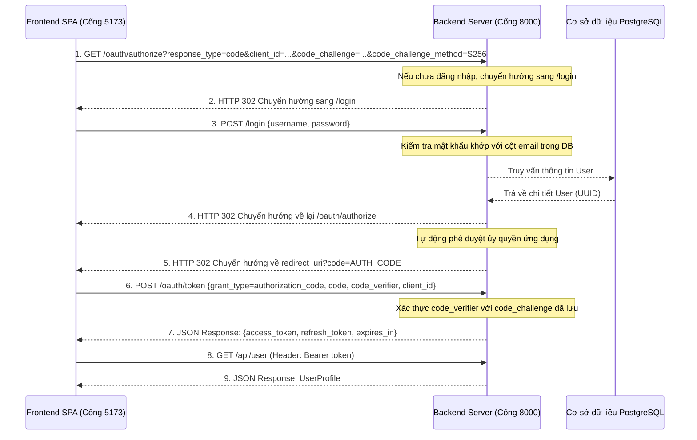

# Tài liệu Luồng Xác thực OAuth 2.0 PKCE

Dự án này sử dụng Laravel Passport phiên bản 13.x để triển khai luồng xác thực mã cấp phép OAuth 2.0 an toàn kết hợp khóa bảo mật PKCE (Proof Key for Code Exchange) dành cho các ứng dụng trang đơn (SPA) và ứng dụng di động.

Cơ chế PKCE loại bỏ việc sử dụng mật khóa máy khách (client secret) trên các ứng dụng public, ngăn chặn hiệu quả các cuộc tấn công đánh chặn token.

---

## 1. Biểu đồ Luồng Xác thực



---

## 2. Cấu hình và Tích hợp Hệ thống

### Tự động Duyệt Ủy quyền Ứng dụng (Custom OAuth Client Model)
Mặc định, Laravel Passport sẽ hiển thị màn hình yêu cầu người dùng xác nhận cấp quyền cho client. Do ứng dụng frontend là ứng dụng nội bộ tin cậy, màn hình này được cấu hình bỏ qua bằng cách ghi đè phương thức `skipsAuthorization` trong mô hình Client tùy chỉnh:
- **Tệp tin**: `app/Models/OAuth/Client.php`
- **Mã nguồn**:
  ```php
  public function skipsAuthorization(Authenticatable $user, array $scopes): bool
  {
      return true; // Bỏ qua màn hình xác nhận cấp quyền
  }
  ```
Được đăng ký trong `AppServiceProvider.php` thông qua:
```php
Passport::useClientModel(\App\Models\OAuth\Client::class);
```

### Đưa thông tin Role vào JWT (Custom JWT Claims)
Để truyền thông tin quyền (roles) của người dùng trực tiếp trong access token định dạng JWT (giúp frontend phân quyền nhanh mà không cần gọi thêm API), hệ thống ghi đè thực thể Token và Repository mặc định của Passport:
- **Lớp AccessToken tùy chỉnh**: `app/Bridge/AccessToken.php` kế thừa từ `AccessToken` của Passport và ghi đè `convertToJWT()` để đưa vai trò của người dùng vào claim `roles`.
- **Lớp AccessTokenRepository tùy chỉnh**: `app/Bridge/AccessTokenRepository.php` dùng để khởi tạo thực thể `AccessToken` tùy chỉnh ở trên.
- **Đăng ký Service Provider**: Được liên kết trong `AppServiceProvider.php` vào singleton `AccessTokenRepositoryInterface` của League:
  ```php
  $this->app->singleton(
      \League\OAuth2\Server\Repositories\AccessTokenRepositoryInterface::class,
      function ($app) {
          return new \App\Bridge\AccessTokenRepository(
              $app->make(\Laravel\Passport\TokenRepository::class),
              $app->make(\Illuminate\Contracts\Events\Dispatcher::class)
          );
      }
  );
  ```

### Cấu hình Khóa UUID
Bảng `users` sử dụng UUID làm khóa chính. Do đó, tất cả các bảng dữ liệu của Passport và session đã được chuyển đổi để hỗ trợ định dạng UUID:
- `oauth_auth_codes.user_id` -> `UUID`
- `oauth_access_tokens.user_id` -> `UUID`
- `oauth_device_codes.user_id` -> `UUID`
- `oauth_clients.owner_id` -> `UUID`
- `sessions.user_id` -> `UUID`

### Cấu hình CORS (Cross-Origin Resource Sharing)
Vì frontend SPA gửi request trực tiếp lấy token từ endpoint `/oauth/token` (khác cổng chạy), cấu hình CORS bắt buộc phải cho phép các cổng này:
- **Tệp tin**: `config/cors.php`
- **Mã nguồn**:
  ```php
  'paths' => ['api/*', 'oauth/*', 'sanctum/csrf-cookie'],
  'allowed_origins' => ['http://localhost:5173', 'http://127.0.0.1:5173'],
  'supports_credentials' => true,
  ```

---

## 3. Các Tệp tin Chính và Vai trò

| Tệp tin / Thành phần | Vai trò và Nhiệm vụ chính |
|---|---|
| [`config/auth.php`](../config/auth.php) | Định nghĩa các guard xác thực. Guard `web` sử dụng driver `session`, guard `api` sử dụng driver `passport`. |
| [`app/Providers/AppServiceProvider.php`](../app/Providers/AppServiceProvider.php) | Cấu hình thời gian hết hạn token của Passport và liên kết các Repository tùy chỉnh. |
| [`app/Http/Requests/Auth/LoginRequest.php`](../app/Http/Requests/Auth/LoginRequest.php) | Xác thực thông tin đầu vào khi POST `/login`, khớp trường nhập `username` với cột `email` trong database. |
| [`app/Models/User.php`](../app/Models/User.php) | Sử dụng các trait `HasApiTokens` và `HasUuids` để tự sinh khóa UUID và liên kết xác thực Passport. |
| [`app/Bridge/AccessToken.php`](../app/Bridge/AccessToken.php) | Ghi đè lớp AccessToken để chèn claim `roles` tùy chỉnh vào payload của JWT. |
| [`app/Bridge/AccessTokenRepository.php`](../app/Bridge/AccessTokenRepository.php) | Ghi đè lớp AccessTokenRepository mặc định để trả về lớp `AccessToken` tùy chỉnh. |
| [`routes/auth.php`](../routes/auth.php) | Khai báo các endpoint xác thực phiên web tối giản (`login` GET/POST). |
| [`routes/api.php`](../routes/api.php) | Khai báo route profile `/api/user` sử dụng middleware `auth:api`. |

---

## 4. Tài liệu Tham khảo API

### 1. Yêu cầu cấp mã Ủy quyền (Authorization Code)
- **Phương thức / URL**: `GET /oauth/authorize`
- **Tham số truy vấn (Query)**:
  - `client_id`: UUID của client.
  - `redirect_uri`: URL callback đích.
  - `response_type`: `code`
  - `code_challenge`: Chuỗi mã hóa SHA-256 base64url.
  - `code_challenge_method`: `S256`
- **Kết quả**: Chuyển hướng về `redirect_uri` kèm tham số `code` sau khi đăng nhập thành công.

### 2. Yêu cầu cấp Access Token
- **Phương thức / URL**: `POST /oauth/token`
- **Headers**:
  - `Content-Type: application/json`
  - `Accept: application/json`
- **Tham số Body**:
  - `grant_type`: `authorization_code`
  - `client_id`: UUID của client.
  - `redirect_uri`: URL callback đích.
  - `code_verifier`: Chuỗi xác thực thô khớp với challenge đã gửi.
  - `code`: Mã authorization code nhận được từ redirect.
- **Kết quả**: Trả về dữ liệu JSON chứa access/refresh token.

### 3. Lấy thông tin người dùng hiện tại
- **Phương thức / URL**: `GET /api/user`
- **Headers**:
  - `Authorization: Bearer <ACCESS_TOKEN>`
  - `Accept: application/json`
- **Kết quả**: Trả về dữ liệu thông tin chi tiết của người dùng.

### 4. Thu hồi Access Token (Đăng xuất API)
- **Phương thức / URL**: `POST /api/logout`
- **Headers**:
  - `Authorization: Bearer <ACCESS_TOKEN>`
  - `Accept: application/json`
- **Kết quả**: Trả về mã HTTP 204 No Content sau khi thu hồi token thành công.
