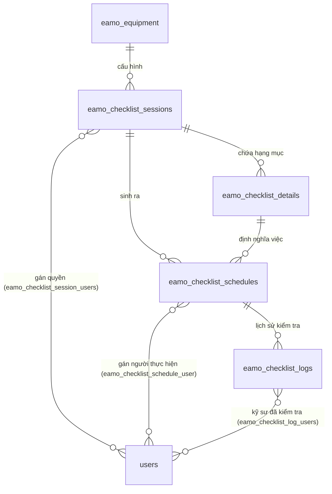

# Phân Tích Logic Cấu Hình & Tự Động Sinh Lịch Kiểm Tra (Checklist Schedules)

Tài liệu này phân tích chi tiết cấu trúc cơ sở dữ liệu, mối quan hệ giữa các bảng, logic tự động sinh lịch kiểm tra (Schedules) cho thiết bị, cơ chế hiển thị trên giao diện Lịch (Calendar View), và hướng dẫn chạy bộ kiểm thử (Unit Test) trên môi trường local.

---

## 1. Mối Quan Hệ Giữa Các Bảng (Database Relationships)

Tính năng quản lý checklist được thiết kế gồm các bảng chính sau:

### 1.1. Chi tiết các bảng
* **`eamo_checklist_sessions`**: Lưu thông tin cấu hình checklist mẫu cho từng thiết bị (`equipment_id`). Bảng này lưu trữ loại chu kỳ kiểm tra (`cycle_type`: `daily`, `weekly`, `monthly`, `yearly`) và khoảng thời gian lặp (`cycle_interval`).
* **`eamo_checklist_details`**: Lưu trữ các hạng mục kiểm tra cụ thể (ví dụ: *"Kiểm tra nhiệt độ máy"*, *"Vệ sinh bộ lọc"*) liên kết với Session (`session_id`).
* **`eamo_checklist_schedules`**: Bản ghi lịch kiểm tra thực tế cho từng hạng mục theo từng ngày (`date`). 
* **`eamo_checklist_logs`**: Kết quả thực hiện của từng lịch kiểm tra (`status`: `pending`/`completed`, `result`: `pass`/`fail`, thời gian kiểm tra `checked_at`).

### 1.2. Sơ đồ Quan hệ Thực thể (ERD)



---

## 2. Phân Tích Luồng Nghiệp Vụ & Logic Xử Lý

Quy trình hoạt động được chia làm 3 giai đoạn chính: **Thiết lập/Cập nhật**, **Tự động sinh lịch**, và **Hiển thị trên Lịch**.

### 2.1. Thiết lập cấu hình checklist
Khi người dùng lưu cấu hình checklist (tại đường dẫn `/maintenance/checklist/detail` trên UI):
1. Hệ thống gọi API `POST /api/v1/checklist-sessions`, xử lý bởi **[StoreChecklistSessionService](file:///c:/Users/Admin/Desktop/New%20folder/eamo-backend/modules/Equipment/Checklist/Services/StoreChecklistSessionService.php)**.
2. Tạo hoặc cập nhật **`ChecklistSession`** ứng với thiết bị (`equipment_id`).
3. Lưu các hạng mục kiểm tra vào bảng **`ChecklistDetail`**.
4. Đồng bộ danh sách kỹ sư chịu trách nhiệm thực hiện vào bảng pivot.

### 2.2. Logic tự động sinh lịch trình (`ChecklistScheduleGeneratorService`)
Sau khi lưu cấu hình, backend gọi dịch vụ **[ChecklistScheduleGeneratorService](file:///c:/Users/Admin/Desktop/New%20folder/eamo-backend/modules/Equipment/Checklist/Services/ChecklistScheduleGeneratorService.php)** để sinh lịch:

#### A. Tính toán danh sách ngày kiểm tra (`generateDates`)
Dựa trên `startDate` (mặc định là hôm nay nếu có chu kỳ lặp), `endDate` (`session_date` nhận từ UI), loại chu kỳ (`cycle_type`), và khoảng cách lặp (`cycle_interval`). Hệ thống sẽ chạy vòng lặp và cộng dồn ngày tương ứng để cho ra danh sách các ngày kiểm tra hợp lệ.

#### B. Cơ chế bảo vệ dữ liệu cũ (`regenerateForSession`)
Khi cấu hình thay đổi (ví dụ: thêm hạng mục kiểm tra mới hoặc đổi chu kỳ), hệ thống sẽ tính toán lại lịch kiểm tra. Để không làm mất dữ liệu đã ghi nhận trước đó, backend áp dụng cơ chế:
1. **Lọc các lịch trình được bảo vệ (Protected)**: 
   - Những lịch trình đã hoàn thành (`ChecklistLog` có `status = completed`).
   - Những lịch trình đã bị đổi lịch thủ công (`is_rescheduled = true`).
2. **Dọn dẹp**: Xóa toàn bộ lịch trình chưa kiểm tra và không bị đổi lịch nằm trong khoảng ngày cấu hình.
3. **Sinh mới**: Tạo các bản ghi `ChecklistSchedule` mới cho những ngày và hạng mục còn thiếu, gán mặc định 1 bản ghi `ChecklistLog` ở trạng thái `pending` (chờ thực hiện) và đồng bộ kỹ sư phụ trách.

### 2.3. Logic hiển thị trạng thái trên Lịch (Frontend Calendar View)
Giao diện lịch của ứng dụng lấy dữ liệu từ API và tự động tính toán trạng thái hiển thị của từng ngày theo quy tắc:
* **Màu Vàng (Chờ kiểm tra - Pending)**: Khi toàn bộ các đầu việc kiểm tra trong ngày đó đều chưa thực hiện (tất cả các `ChecklistLog` liên quan đều ở trạng thái `pending`).
* **Màu Đỏ (Không đạt - Failed)**: Khi có **ít nhất một** đầu việc kiểm tra của ngày hôm đó bị đánh giá là lỗi (`result = fail`).
* **Màu Xanh lá (Đã đạt - Passed)**: Khi tất cả các đầu việc của ngày đó đều đã được kiểm tra xong (`status = completed`) và **đều thành công** (`result = pass`).

---

## 3. Hướng Dẫn Chạy Kiểm Thử (Unit Test)

Bộ kiểm thử tự động đã được xây dựng tại **[ChecklistScheduleGeneratorTest.php](file:///c:/Users/Admin/Desktop/New%20folder/eamo-backend/tests/Unit/ChecklistScheduleGeneratorTest.php)** để xác thực thuật toán sinh ngày theo chu kỳ.

### 3.1. Cấu hình kiểm thử (`tests/Pest.php`)
Do trên một số môi trường local thiếu driver SQLite (thường dùng cho DB memory khi chạy test trong Laravel), file cấu hình **[Pest.php](file:///c:/Users/Admin/Desktop/New%20folder/eamo-backend/tests/Pest.php)** đã được điều chỉnh để thư mục `tests/Unit` kế thừa `TestCase` giúp khởi động Service Container nhưng **không chạy lại migrations** (bỏ qua `RefreshDatabase`). Nhờ vậy bộ kiểm thử chạy độc lập mà không cần phụ thuộc vào driver SQLite.

### 3.2. Lệnh chạy test trên máy local
Mở terminal tại thư mục gốc của backend (`eamo-backend`) và chạy lệnh sau:

```bash
php artisan test --filter=ChecklistScheduleGeneratorTest --compact
```

### 3.3. Kết quả chạy thử nghiệm thành công
```json
{"tool":"pest","result":"passed","tests":4,"passed":4,"assertions":16,"duration_ms":390}
```
* **Số test case**: 4 (Kiểm tra chu kỳ Hàng ngày, Hàng tuần, Hàng tháng và trường hợp ném lỗi khi chu kỳ không hợp lệ).
* **Số lượng assertion**: 16.
* **Thời gian thực hiện**: ~390ms.
