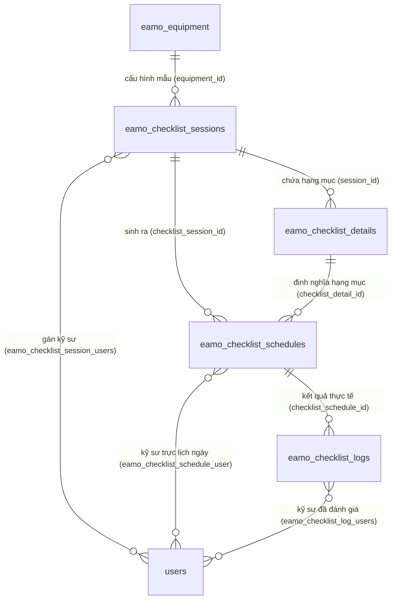

# Tài liệu Luồng Quản lý & Tự Động Sinh Lịch Kiểm Tra (Checklist Management)

Tài liệu này phân tích chi tiết thiết kế cơ sở dữ liệu, luồng nghiệp vụ khi cấu hình checklist, logic tự động sinh lịch kiểm tra (Schedules & Logs) thông qua dịch vụ `ChecklistScheduleGeneratorService`, cơ chế bảo vệ dữ liệu đã thực hiện, quy trình hoàn thành/đánh giá, và hướng dẫn chạy kiểm thử tự động (Unit Test).

---

## 1. Mối Quan Hệ Giữa Các Bảng (Database Architecture & ERD)

Hệ thống quản lý checklist hoạt động dựa trên các bảng chính sau:

### 1.1. Chi tiết các bảng dữ liệu
1. **`eamo_checklist_sessions` (`ChecklistSession`):**
   - Đóng vai trò là **Template / Cấu hình mẫu** checklist cho một thiết bị cụ thể (`equipment_id`).
   - Lưu trữ chu kỳ kiểm tra: loại chu kỳ (`cycle_type`: `daily`, `weekly`, `monthly`, `yearly`) và khoảng thời gian lặp (`cycle_interval`).
   - Lưu ngày kết thúc hiệu lực của chu kỳ cấu hình (`session_date`).
2. **`eamo_checklist_details` (`ChecklistDetail`):**
   - Lưu trữ các **Hạng mục kiểm tra chi tiết** cụ thể (ví dụ: *"Kiểm tra mức dầu"*, *"Vệ sinh lưới lọc"*) thuộc về một Session mẫu (`session_id`).
3. **`eamo_checklist_schedules` (`ChecklistSchedule`):**
   - Lưu trữ **Lịch trình kiểm tra thực tế** của từng hạng mục chi tiết (`checklist_detail_id`) theo từng ngày cụ thể (`date`).
   - Chứa thông tin về việc dời lịch: `is_rescheduled` (đã dời lịch thủ công) và `original_date` (ngày được xếp lịch ban đầu).
4. **`eamo_checklist_logs` (`ChecklistLog`):**
   - Ghi lại **Kết quả kiểm tra thực tế** của một lịch trình cụ thể (`checklist_schedule_id`).
   - Trạng thái kiểm tra: `status` (`pending` - đang chờ / `completed` - đã hoàn thành).
   - Kết quả đánh giá: `result` (`pass` - đạt / `fail` - không đạt / `null` - chưa đánh giá).
   - Lưu vết thời điểm kiểm tra (`checked_at`).

### 1.2. Mối quan hệ qua bảng pivot
- **Gán kỹ sư phụ trách Session:** Quan hệ Nhiều-Nhiều giữa `eamo_checklist_sessions` và `users` thông qua bảng pivot **`eamo_checklist_session_users`**.
- **Gán kỹ sư phụ trách Lịch trình cụ thể:** Quan hệ Nhiều-Nhiều giữa `eamo_checklist_schedules` và `users` thông qua bảng pivot **`eamo_checklist_schedule_user`**.
- **Kỹ sư thực hiện đánh giá thực tế:** Quan hệ Nhiều-Nhiều giữa `eamo_checklist_logs` và `users` thông qua bảng pivot **`eamo_checklist_log_users`**.

### 1.3. Sơ đồ Quan hệ Thực thể (ERD)



---

## 2. Quy Trình Cấu Hình Checklist

### 2.1. Thêm Mới Checklist Session (`StoreChecklistSessionService`)
Khi người dùng tạo cấu hình checklist cho một thiết bị trên giao diện:
1. Yêu cầu `POST /api/v1/checklist-sessions` được chuyển đến **`StoreChecklistSessionService`**.
2. **DB Transaction**: Toàn bộ tiến trình chạy trong một transaction để đảm bảo tính toàn vẹn dữ liệu.
3. **Tạo Session Template**: Tạo bản ghi trong `eamo_checklist_sessions`.
4. **Đồng bộ kỹ sư phụ trách**: Lưu thông tin pivot `eamo_checklist_session_users` và gửi thông báo hệ thống.
5. **Tạo Hạng mục chi tiết**: Tạo các bản ghi `ChecklistDetail` liên kết với Session.
6. **Kích hoạt tự động sinh lịch**: Gọi `generateForSession` / `regenerateForSession` của `ChecklistScheduleGeneratorService` để sinh lịch kiểm tra cho từng hạng mục theo các ngày tương ứng.

### 2.2. Cập Nhật Cấu Hình Checklist (`ChecklistSessionUpdateService`)
Khi người dùng sửa cấu hình checklist (đổi chu kỳ lặp, đổi ngày kết thúc, thêm/bớt hạng mục):
1. Yêu cầu `PUT /api/v1/checklist-sessions/{id}` gọi đến **`ChecklistSessionUpdateService`**.
2. Cập nhật các thông tin Session và đồng bộ lại danh sách kỹ sư phụ trách.
3. Gọi `regenerateForSession` để tính toán lại lịch bắt đầu từ hôm nay cho đến ngày kết thúc `session_date`.

---

## 3. Thuật Toán Tự Động Sinh Lịch (`ChecklistScheduleGeneratorService`)

### 3.1. Tính toán danh sách ngày kiểm tra (`generateDates`)
Hàm nhận ngày bắt đầu (`startDate`), ngày kết thúc (`endDate`), loại chu kỳ (`cycleType`), và khoảng lặp (`cycleInterval`):

```php
public function generateDates(
    CarbonImmutable $startDate,
    CarbonImmutable $endDate,
    string $cycleType,
    int $cycleInterval
): array {
    $dates = [];
    $currentDate = $startDate;

    while ($currentDate->lessThanOrEqualTo($endDate)) {
        $dates[] = $currentDate;
        $currentDate = match ($cycleType) {
            'daily' => $currentDate->addDays($cycleInterval),
            'weekly' => $currentDate->addWeeks($cycleInterval),
            'monthly' => $currentDate->addMonths($cycleInterval),
            'yearly' => $currentDate->addYears($cycleInterval),
            default => throw new \InvalidArgumentException("Invalid cycle type: {$cycleType}"),
        };
    }

    return $dates;
}
```

### 3.2. Giới hạn số lượng lịch kiểm tra tối đa (`MAX_SCHEDULES = 100`)
Để bảo vệ hệ thống khỏi việc tạo chu kỳ quá ngắn và khoảng thời gian quá dài gây tràn bộ nhớ:
$$\text{Tổng số lượng lịch trình} = \text{Số lượng ngày tính được} \times \text{Số lượng hạng mục chi tiết}$$
Nếu tổng này vượt quá **100** (`self::MAX_SCHEDULES`), hệ thống sẽ ném ngoại lệ `ValidationException` dừng tiến trình và trả về lỗi cho Client.

### 3.3. Cơ chế Bảo vệ Dữ liệu đã thực hiện (`regenerateForSession`)
Khi tái sinh lịch do thay đổi cấu hình, hệ thống **bảo vệ tuyệt đối** các dữ liệu lịch sử thông qua 3 bước:

1. **Thu thập danh sách Lịch trình được bảo vệ (Protected IDs):**
   - Đã được hoàn thành kiểm tra (`ChecklistLog` liên kết có `status = 'completed'`).
   - Đã bị dời lịch thủ công (`is_rescheduled = true`).
2. **Dọn dẹp Lịch trình chưa thực hiện (Unprotected):**
   - Xóa các bản ghi `ChecklistSchedule` nằm trong khoảng ngày cấu hình nhưng **không** nằm trong danh sách bảo vệ trên (thực hiện soft delete liên hoàn).
3. **Sinh bổ sung các Lịch trình còn thiếu:**
   - Duyệt qua từng ngày tính toán được và từng hạng mục `ChecklistDetail`.
   - Tạo mới `ChecklistSchedule` + mặc định 1 bản ghi `ChecklistLog` ở trạng thái `pending`.

---

## 4. Hoàn Thành & Đánh Giá Checklist

### 4.1. Thực hiện Kiểm tra (`CompleteChecklistScheduleAction`)
- **API**: `POST /api/v1/checklist-schedules/{id}/complete`
- **Quyền**: `engineer`
- **Input**: `{ "result": "pass" | "fail", "note": "..." }`
- **Xử lý**: Cập nhật `ChecklistLog` liên kết từ `pending` sang `completed`, ghi nhận `checked_at` và kỹ sư thực hiện.

### 4.2. Đánh giá Session (`JudgeSessionAction`)
- **API**: `POST /api/v1/checklist-sessions/judge`
- **Quyền**: `manager`
- **Xử lý**: Quản lý rà soát và đánh giá kết quả tổng thể của checklist session.

### 4.3. Quy tắc Trạng thái trên Lịch (Frontend Calendar View)
- **Màu Vàng (Pending - Chờ kiểm tra)**: Tất cả các đầu việc kiểm tra trong ngày đó đều ở trạng thái `pending`.
- **Màu Đỏ (Failed - Không đạt)**: Có **ít nhất một** đầu việc trong ngày bị đánh giá lỗi (`result = fail`).
- **Màu Xanh lá (Passed - Đã đạt)**: Tất cả đầu việc trong ngày đều đã kiểm tra (`status = completed`) và **đều thành công** (`result = pass`).

---

## 5. Danh Sách Endpoints API Checklist

| Method | Endpoint | Middleware | Mô tả |
|---|---|---|---|
| GET | `/api/v1/checklist-sessions/equipment-status` | `engineer` | Lấy trạng thái checklist của tất cả thiết bị |
| GET | `/api/v1/checklist-sessions/daily` | `engineer` | Danh sách checklist trong ngày |
| GET | `/api/v1/checklist-sessions` | `engineer` | Danh sách cấu hình checklist |
| GET | `/api/v1/checklist-sessions/{id}` | `engineer` | Chi tiết cấu hình checklist |
| GET | `/api/v1/checklist-details` | `engineer` | Danh sách hạng mục chi tiết |
| POST | `/api/v1/checklist-schedules/{id}/complete` | `engineer` | Hoàn thành đánh giá 1 lịch kiểm tra |
| POST | `/api/v1/checklist-sessions/daily` | `manager` | Sinh phiên kiểm tra hàng ngày thủ công |
| DELETE | `/api/v1/checklist-schedules/daily` | `manager` | Xóa các lịch kiểm tra trong ngày |
| POST | `/api/v1/checklist-sessions` | `manager` | Tạo cấu hình mẫu checklist |
| PUT | `/api/v1/checklist-sessions/{id}` | `manager` | Cập nhật cấu hình checklist |
| DELETE | `/api/v1/checklist-sessions/{id}` | `manager` | Xóa cấu hình mẫu checklist |
| POST | `/api/v1/checklist-sessions/judge` | `manager` | Phê duyệt đánh giá phiên kiểm tra |

---

## 6. Hướng Dẫn Chạy Kiểm Thử (Unit Test)

Bộ test cho thuật toán sinh lịch nằm tại [`tests/Unit/ChecklistScheduleGeneratorTest.php`](file:///c:/Users/khanh/Projects/eamo/backend/tests/Unit/ChecklistScheduleGeneratorTest.php).

Chạy lệnh sau tại terminal root dự án:

```bash
php artisan test --filter=ChecklistScheduleGeneratorTest --compact
```
