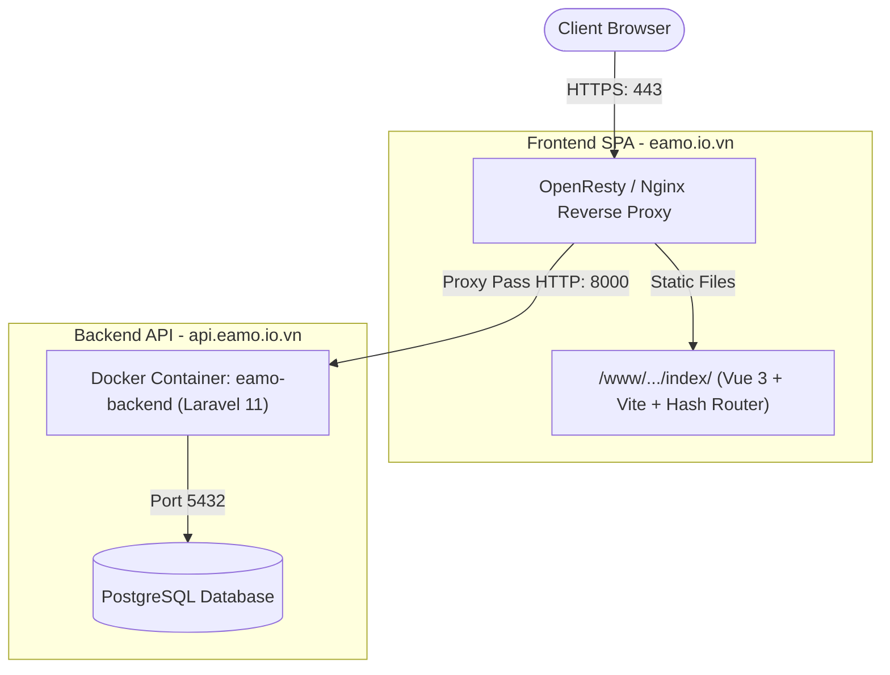

# Tài liệu Phân tích Sự cố Triển khai (Deployment Postmortem & Troubleshooting)

Tài liệu này tổng hợp toàn bộ các vấn đề kỹ thuật, nguyên nhân gốc rễ (Root Cause), giải pháp khắc phục và checklist chuẩn hóa trong quá trình triển khai hệ thống **EAMO (Enterprise Asset & Maintenance Operations)** lên môi trường máy chủ sản xuất (Production VPS).

---

## 1. Kiến trúc Hệ thống Triển khai (System Architecture)



* **Frontend SPA**: `https://eamo.io.vn` (Vben Admin 5, Vue 3, TypeScript, Ant Design Vue, Hash Router `createWebHashHistory`).
* **Backend API & OAuth**: `https://api.eamo.io.vn` (Laravel 11, Laravel Passport v13 PKCE, PHP 8.4).
* **Cơ sở dữ liệu**: PostgreSQL với các bảng quản lý thiết bị và vận hành mang tiền tố `eamo_`.

---

## 2. Tổng hợp 5 Sự cố Trọng yếu & Giải pháp Kỹ thuật

### 2.1. Sự cố 1: Dính Mock API mặc định của Template Vben Admin

#### Hiện tượng:
* Đăng nhập thành công, phân quyền tải bình thường nhưng **toàn bộ dữ liệu nghiệp vụ không hiển thị**:
  * Các ô chọn (Select) thiết bị, danh mục bảo dưỡng, hạng mục kiểm tra bị rỗng.
  * Màn hình Lịch (Calendar) trên Workspace trắng tinh dù trong database đã có dữ liệu.
  * Tab mạng (Network) phát sinh request đến đường dẫn lạ: `https://mock-napi.vben.pro/api/users/.../notifications`.

#### Nguyên nhân gốc rễ (Root Cause):
* File `.env.production` của source frontend vẫn giữ nguyên cấu hình mẫu từ repo Vben Admin:
  ```env
  VITE_GLOB_API_URL=https://mock-napi.vben.pro/api
  ```
* Khi build (`pnpm build`), Vite đã nhúng URL này vào file cấu hình nạp động `_app-config-5.7.0-*.js` và đóng băng bằng `Object.freeze()`.
* Mọi hàm gọi qua `requestClient` (lấy thiết bị, lịch checklist, thông báo) đều gửi truy vấn sang server demo của Vben tại Trung Quốc thay vì backend thật, dẫn đến kết quả 404 hoặc rỗng.

#### Giải pháp khắc phục:
1. **Cập nhật mã nguồn local (`frontend/.env.production`)**:
   ```env
   VITE_GLOB_API_URL=https://api.eamo.io.vn/api
   VITE_BACKEND_BASE_URL=https://api.eamo.io.vn
   ```
2. **Cập nhật runtime config trên server**: Thay thế chuỗi `https://mock-napi.vben.pro/api` thành `https://api.eamo.io.vn/api` trong `_app-config-*.js` và chunk `store-*.js`.

---

### 2.2. Sự cố 2: Xung đột Kiến trúc giữa Hash Router (`/#/`) và Chuẩn OAuth 2.0 Callback

#### Hiện tượng:
* Trình duyệt rơi vào **vòng lặp chuyển hướng vô tận (Redirect Loop)**:
  `/login` $\leftrightarrow$ `/oauth/authorize` $\leftrightarrow$ `/auth/callback`. Màn hình nhấp nháy liên tục và tab Network ghi nhận hàng trăm request trong vài giây.

#### Nguyên nhân gốc rễ (Root Cause):
* Frontend sử dụng **Hash Router** (`createWebHashHistory`), các route nội bộ của ứng dụng luôn nằm sau ký tự `#` (ví dụ: `/#/auth/callback`).
* Chuẩn OAuth 2.0 PKCE của Laravel Passport khi xác thực thành công sẽ redirect về theo chuẩn Path:
  `https://eamo.io.vn/auth/callback?code=...&state=...` (không có dấu `#`).
* Khi trình duyệt tải URL này, Vue Router coi đây là đường dẫn gốc `/` hoặc route không hợp lệ, trigger router guard đá người dùng quay lại `/login` ở backend, tạo ra vòng lặp lặp đi lặp lại.

#### Giải pháp khắc phục:
* **Thêm Bridge Script tiền khởi tạo trong `index.html`** (chạy trước khi Vue App và Router được mount):
  ```html
  <script>
    // Chuyển hướng OAuth callback từ Path sang Hash route trước khi Vue Router khởi chạy
    (function () {
      var pathname = window.location.pathname;
      var search = window.location.search;
      if (pathname.indexOf('/auth/callback') !== -1 && search.indexOf('code=') !== -1) {
        var hashTarget = '/#' + pathname + search;
        window.location.replace(window.location.origin + hashTarget);
      }
    })();
  </script>
  ```
* Bổ sung route alias trong `router/routes/core.ts` cho các đường dẫn fallback (`/login`, `/analytics`) tự động điều hướng về trang chủ mặc định (`/dashboard/workspace`).

---

### 2.3. Sự cố 3: Lỗi Phân tách Chunk khi Build Vite (Duplicate vue-router Chunks)

#### Hiện tượng:
* Token lấy về thành công (`Detected user roles: Array(1)`), nhưng giao diện bị **trắng màn hình hoàn toàn (White Screen of Death)**.
* Báo lỗi tại Console:
  * `SyntaxError: The requested module './vue-router-yaHRrQUp.js' does not provide an export named 're'`
  * Hoặc `TypeError: Cannot read properties of undefined (reading 'getRoutes')`.

#### Nguyên nhân gốc rễ (Root Cause):
* Quá trình Rollup/Vite code-splitting khi đóng gói production đã chia tách thư viện `vue-router` thành 2 chunk: chunk chính (`vue-router-yaHRrQUp.js`) và chunk phụ (`vue-router-BPN-LIZc.js`).
* File layout (`basic.vue`) import các hooks điều hướng (`useRouter`, `useRoute`, `RouterView`) từ chunk phụ. Tuy nhiên, chunk phụ không chia sẻ cùng scope instance và mapping export alias bị sai lệch so với bản build, khiến hàm `useRouter()` trả về `undefined`.

#### Giải pháp khắc phục:
* Cấu hình đồng bộ chính xác export mapping giữa 2 chunk:
  * `i` (`ne` trong file gốc) = `useRouter` $\rightarrow$ export tên `r`
  * `r` (`re` trong file gốc) = `useRoute` $\rightarrow$ export tên `n`
  * `v` (`dt` trong file gốc) = `RouterView` $\rightarrow$ export tên `t`
* Nội dung bridge chuẩn cho `vue-router-BPN-*.js`:
  ```javascript
  import{i as r,r as n,v as t}from"./vue-router-yaHRrQUp.js";export{n,r,t};
  ```

---

### 2.4. Sự cố 4: SSL Termination qua Reverse Proxy & Thiếu Trust Proxy trong Laravel 11

#### Hiện tượng:
* Lỗi **Mixed Content**: Trình duyệt chạy trên `https://eamo.io.vn` chặn các request API hoặc OAuth vì backend trả về đường dẫn `http://api.eamo.io.vn`.
* Request OAuth bị từ chối do `redirect_uri` không trùng khớp giữa HTTP và HTTPS.

#### Nguyên nhân gốc rễ (Root Cause):
* OpenResty tiếp nhận traffic bảo mật HTTPS (port 443) từ bên ngoài, sau đó forward vào Docker container backend qua giao thức HTTP nội bộ (port 8000).
* Laravel mặc định không tin cậy các header của reverse proxy (`X-Forwarded-Proto`, `X-Forwarded-For`), khiến các helper `url()`, `route()` và Passport OAuth coi kết nối hiện tại là HTTP không bảo mật.

#### Giải pháp khắc phục:
1. **Khai báo Trust Proxy trong `backend/bootstrap/app.php`**:
   ```php
   ->withMiddleware(function (Middleware $middleware): void {
       $middleware->trustProxies(at: '*');
       // ...
   })
   ```
2. **Ép buộc giao thức HTTPS trong `backend/app/Providers/AppServiceProvider.php`**:
   ```php
   public function boot(): void
   {
       if (app()->environment('production') || request()->header('X-Forwarded-Proto') === 'https') {
           \Illuminate\Support\Facades\URL::forceScheme('https');
       }
   }
   ```

---

### 2.5. Sự cố 5: Script Tracking Bên Thứ Ba gây Nghẽn Tiến Trình (Baidu Tongji)

#### Hiện tượng:
* Trình duyệt ném cảnh báo đỏ trong Console:
  `[Violation] Permissions policy violation: unload is not allowed in this document.`
* Trang web có thời điểm bị khựng hoặc đóng băng tiến trình render.

#### Nguyên nhân gốc rễ (Root Cause):
* Template gốc Vben Admin nhúng sẵn script phân tích người dùng của Baidu (`hm.baidu.com/hm.js`) bên trong thẻ `<head>` của `index.html`.
* Môi trường mạng quốc tế và chính sách bảo mật trình duyệt chặn các kết nối của script này, gây chậm trễ cho tiến trình hydrate giao diện Vue.

#### Giải pháp khắc phục:
* Xóa bỏ hoàn toàn đoạn mã tracking Baidu trong `frontend/index.html` và bản build `frontend/dist/index.html`.

---

## 3. Quy trình Kiểm tra Chuẩn khi Triển khai (Deployment Checklist)

Trước khi kích hoạt phiên bản mới lên môi trường Production, bắt buộc kiểm tra các tiêu chí sau:

### Danh mục Backend:
- [ ] File `.env` trên VPS cấu hình đúng:
  * `APP_ENV=production` & `APP_DEBUG=false`
  * `APP_URL=https://api.eamo.io.vn`
- [ ] Chạy migrate cơ sở dữ liệu: `php artisan migrate --force`
- [ ] Chạy tối ưu hóa cache Laravel:
  ```bash
  php artisan config:cache
  php artisan route:cache
  php artisan view:cache
  ```
- [ ] Passport keys đã được khởi tạo và phân quyền hợp lệ (`storage/oauth-private.key`, `storage/oauth-public.key`).

### Danh mục Frontend:
- [ ] File `frontend/.env.production` đã trỏ đúng:
  * `VITE_GLOB_API_URL=https://api.eamo.io.vn/api`
  * `VITE_BACKEND_BASE_URL=https://api.eamo.io.vn`
- [ ] File `index.html` không chứa script lạ từ template mẫu (Baidu, Google tag không dùng...).
- [ ] Đã có bridge script xử lý OAuth callback cho Hash Router trong `index.html`.
- [ ] Sau khi upload thư mục `dist/`, xóa cache trình duyệt (`Ctrl + Shift + R`) để tránh nạp lại file `.js` cũ.

### Danh mục Nginx / OpenResty:
- [ ] Đã chuyển hướng toàn bộ HTTP (80) sang HTTPS (443).
- [ ] Cấu hình đầy đủ các proxy headers:
  ```nginx
  proxy_set_header Host $host;
  proxy_set_header X-Real-IP $remote_addr;
  proxy_set_header X-Forwarded-For $proxy_add_x_forwarded_for;
  proxy_set_header X-Forwarded-Proto $scheme;
  ```
- [ ] Cấu hình CORS cho phép origin `https://eamo.io.vn` truy cập tài nguyên API.
