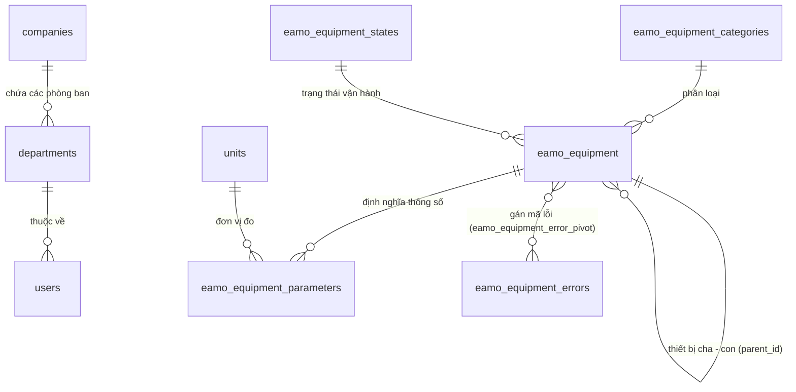

# Tài liệu Luồng Quản lý Danh mục Thiết bị & Dữ liệu Nền tảng (Equipment Masterdata)

Tài liệu này mô tả chi tiết kiến trúc dữ liệu, các mối quan hệ thực thể, các API và logic nghiệp vụ xử lý dữ liệu danh mục nền tảng (Masterdata) cho thiết bị trong hệ thống EAMO.

---

## 1. Mối Quan Hệ Giữa Các Bảng Dữ Liệu (ERD)

Mô-đun Masterdata quản lý các cấu trúc dữ liệu chính phục vụ việc quản lý thiết bị trong nhà máy.

---

## 2. Chi Tiết Các Thực Thể Core Masterdata

### 2.1. Thiết Bị (`eamo_equipment` / `Equipment`)
Bảng trung tâm quản lý danh máy móc / thiết bị:
- `id` (UUID PK): Mã định danh duy nhất của thiết bị.
- `code` (string): Mã ký hiệu thiết bị (VD: `EQ-PUMP-01`).
- `name` (string): Tên thiết bị (VD: `Máy bơm áp lực cao`).
- `qr_code` (string): Mã QR định danh thiết bị.
- `parent_id` (UUID nullable): Khóa ngoại tự tham chiếu (`parent_id` -> `eamo_equipment.id`) tạo cấu trúc cây thiết bị cha - con (Component / System / Sub-system).
- `equipment_category_id` (UUID FK): Thuộc danh mục thiết bị nào.
- `equipment_state_id` (UUID FK): Trạng thái vận hành hiện tại (Đang chạy, Đang dừng, Đang sửa chữa...).
- `maintenance_interval_hours` (integer nullable): Chu kỳ bảo trì định kỳ tính theo giờ vận hành.
- `last_maintenance` (json nullable): Lưu mốc thông tin bảo trì gần nhất.
- `is_active` (boolean): Trạng thái kích hoạt trong hệ thống.

### 2.2. Thông Số Thiết Bị (`eamo_equipment_parameters` / `EquipmentParameter`)
Định nghĩa các chỉ số cần đo lường của thiết bị (Nhiệt độ, Áp suất, Rung động, Tần số...):
- `equipment_id` (UUID FK): Thuộc thiết bị nào.
- `unit_id` (UUID FK): Đơn vị đo (`°C`, `bar`, `Hz`, `rpm`...).
- `min_value` / `max_value` (float nullable): Ngưỡng giá trị an toàn min/max.

### 2.3. Mã Lỗi Thiết Bị (`eamo_equipment_errors` / `EquipmentError`)
Định nghĩa các loại sự cố / mã lỗi thường gặp của thiết bị:
- `error_code` (string): Mã lỗi (VD: `ERR-001`).
- `error_name` (string): Tên lỗi (VD: `Qúa nhiệt động cơ`).
- Được liên kết với thiết bị thông qua bảng pivot `eamo_equipment_error_pivot`.

---

## 3. Các Logic Nghiệp Vụ Đặc Thụ

### 3.1. Giải mã Mã QR Code tìm Thiết bị (`DecodeQrAndGetEquipmentAction`)
- **API**: `POST /api/v1/equipment/decode-qr`
- **Xử lý**:
  1. Client tải lên file ảnh mã QR thông qua form-data field `qr_image`.
  2. Action nhận request và chuyển cho `DecodeQrEquipmentService`.
  3. Service thực hiện đọc dữ liệu hình ảnh, giải mã ra mã QR text và truy vấn thiết bị tương ứng trong database.
  4. Trả về thông tin thiết bị ead cùng đầy đủ các mối quan hệ: `equipmentCategory`, `equipmentErrors`, `equipmentParameters.unit`, `equipmentState`, `equipmentImages`.

### 3.2. Cấu trúc Phân cấp Thiết bị Cha - Con (`UpdateEquipmentParentAction`)
- **API**: `PATCH /api/v1/equipment/{id}/parent`
- **Xử lý**:
  1. Cho phép cập nhật `parent_id` của thiết bị.
  2. Hỗ trợ mô hình hóa dây chuyền sản xuất: Nhà máy -> Dây chuyền -> Cụm máy -> Chi tiết phụ tùng.

### 3.3. Dashboard Thống Kê Tổng Quan (`GetDashboardSummaryAction`)
- **API**: `GET /api/v1/equipment/dashboard/summary`
- **Xử lý**: Trả về số lượng tổng tổng số thiết bị, số lượng thiết bị theo từng trạng thái vận hành, danh sách thiết bị sắp đến hạn bảo trì.

---

## 4. Danh Sách Endpoints API Masterdata

### 4.1. Quản lý Thiết bị (`/api/v1/equipment`)

| Method | Endpoint | Middleware | Mục đích |
|---|---|---|---|
| GET | `/api/v1/equipment` | `engineer` | Danh sách thiết bị (hỗ trợ phân trang, lọc) |
| GET | `/api/v1/equipment/dashboard/summary` | `engineer` | Thống kê tổng quan thiết bị |
| POST | `/api/v1/equipment/decode-qr` | `engineer` | Quét / Giải mã ảnh QR Code |
| GET | `/api/v1/equipment/{id}` | `engineer` | Chi tiết thiết bị |
| POST | `/api/v1/equipment` | `manager` | Tạo mới thiết bị |
| PUT | `/api/v1/equipment/{id}` | `manager` | Cập nhật thông tin thiết bị |
| PATCH | `/api/v1/equipment/{id}/parent` | `manager` | Cập nhật thiết bị cha |
| POST | `/api/v1/equipment/{id}/errors` | `manager` | Gán danh sách mã lỗi cho thiết bị |
| DELETE | `/api/v1/equipment/{id}` | `manager` | Xóa (Soft Delete) thiết bị |

### 4.2. Các Danh Mục Nền Tảng Khác

| Prefix Endpoint | Dữ liệu quản lý | Quyền Xem | Quyền Thêm/Sửa/Xóa |
|---|---|---|---|
| `/api/v1/equipment-parameters` | Thông số kỹ thuật thiết bị | `engineer` | `manager` |
| `/api/v1/equipment-errors` | Danh mục mã lỗi sự cố | `engineer` | `manager` |
| `/api/v1/equipment-categories` | Phân loại nhóm thiết bị | `engineer` | `manager` |
| `/api/v1/units` | Đơn vị đo lường | `engineer` | `manager` |
| `/api/v1/equipment-states` | Trạng thái vận hành thiết bị | `engineer` | `manager` |
| `/api/companies` | Công ty nội bộ | `admin` | `admin` |
| `/api/departments` | Phòng ban / Xưởng | `admin` | `admin` |
| `/api/users` | Tài khoản người dùng | `admin` | `admin` |
