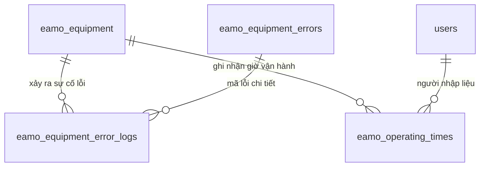

# Tài liệu Luồng Giám Sát Lỗi & Thời Gian Vận Hành (Error Monitoring & Operating Time)

Tài liệu này mô tả chi tiết kiến trúc dữ liệu và logic nghiệp vụ giám sát sự cố lỗi thiết bị, quản lý thời gian vận hành thực tế (Operating Time), thuật toán tính toán số giờ vận hành còn lại trước bảo trì, và chức năng nhập dữ liệu hàng loạt từ Excel.

---

## 1. Mối Quan Hệ Giữa Các Bảng (Database Architecture & ERD)

---

## 2. Chi Tiết Thực Thể Dữ Liệu

### 2.1. Nhật Ký Lỗi Thiết Bị (`eamo_equipment_error_logs` / `EquipmentErrorLog`)
Lưu trữ thông tin chi tiết về các sự cố hỏng hóc / lỗi kỹ thuật xảy ra trên thiết bị:
- `equipment_id` (UUID FK): Thiết bị gặp lỗi.
- `equipment_error_id` (UUID FK): Loại mã lỗi xảy ra.
- `occurrence_time` (datetime): Thời điểm phát sinh lỗi.
- `resolved_time` (datetime nullable): Thời điểm khắc phục xong.
- `description` (text): Mô tả chi tiết nguyên nhân / tình trạng.

### 2.2. Thời Gian Vận Hành (`eamo_operating_times` / `OperatingTime`)
Ghi nhận số giờ chạy máy thực tế của thiết bị theo ca / ngày:
- `equipment_id` (UUID FK): Thiết bị vận hành.
- `start_time` / `end_time` (datetime): Thời gian bắt đầu và kết thúc ca chạy.
- `actual_operating_time` (float): Số giờ chạy thực tế (đã trừ thời gian dừng máy / sự cố).
- `recorded_by` (UUID FK): Người ghi nhận.

---

## 3. Các Logic Nghiệp Vụ Quan Trọng

### 3.1. Thuật Toán Biểu Đồ Trạng Thái Bảo Trì (`GetMaintenanceStatusChartAction`)
- **API**: `GET /api/v1/equipment/error-monitoring/operating-times/maintenance-status`
- **Quyền**: `engineer`
- **Mục tiêu**: Tính toán số giờ chạy máy còn lại trước khi thiết bị bắt buộc phải dừng để bảo trì định kỳ.
- **Thuật toán xử lý**:
  1. Lấy danh sách các thiết bị đang hoạt động (`is_active = true`) có cấu hình chu kỳ bảo trì (`maintenance_interval_hours > 0`).
  2. Xác định mốc thời gian bảo trì gần nhất từ thuộc tính `last_maintenance['datetime']`.
  3. Tính tổng số giờ vận hành thực tế đã tích lũy từ mốc bảo trì gần nhất:
     $$\text{actualOp} = \sum \text{actual\_operating\_time} \quad \text{với } \text{start\_time} \ge \text{lastMaintenanceDate}$$
  4. Tính số giờ còn lại:
     $$\text{remaining} = \text{maintenance\_interval\_hours} - \text{actualOp}$$
  5. Sắp xếp danh sách **tăng dần theo `remaining`** để đưa các thiết bị sắp hết hạn bảo trì lên đầu biểu đồ.

### 3.2. Import Thời Gian Vận Hành Từ File Excel (`ImportOperatingTimeAction`)
- **API**: `POST /api/v1/equipment/error-monitoring/operating-times/import`
- **Quyền**: `manager`
- **Mục tiêu**: Cho phép quản lý tải file Excel dữ liệu thời gian chạy máy của hàng loạt thiết bị trong ca/tuần/tháng để nhập tự động vào hệ thống.

---

## 4. Danh Sách Endpoints API

### 4.1. Nhật Ký Lỗi (`equipment-error-logs`)

| Method | Endpoint | Middleware | Mô tả |
|---|---|---|---|
| GET | `/api/v1/equipment/error-monitoring/equipment-error-logs` | `engineer` | Danh sách nhật ký lỗi thiết bị |
| POST | `/api/v1/equipment/error-monitoring/equipment-error-logs` | `manager` | Ghi nhận sự cố lỗi mới |
| PUT | `/api/v1/equipment/error-monitoring/equipment-error-logs/{id}` | `manager` | Cập nhật thông tin / khắc phục lỗi |
| DELETE | `/api/v1/equipment/error-monitoring/equipment-error-logs/{id}` | `manager` | Xóa bản ghi lỗi |

### 4.2. Thời Gian Vận Hành (`operating-times`)

| Method | Endpoint | Middleware | Mô tả |
|---|---|---|---|
| GET | `/api/v1/equipment/error-monitoring/operating-times` | `engineer` | Danh sách thời gian vận hành |
| GET | `/api/v1/equipment/error-monitoring/operating-times/maintenance-status` | `engineer` | Biểu đồ số giờ vận hành còn lại trước bảo trì |
| POST | `/api/v1/equipment/error-monitoring/operating-times` | `manager` | Thêm thời gian vận hành thủ công |
| POST | `/api/v1/equipment/error-monitoring/operating-times/import` | `manager` | Import thời gian vận hành từ Excel |
| PUT | `/api/v1/equipment/error-monitoring/operating-times/{id}` | `manager` | Cập nhật thời gian vận hành |
| DELETE | `/api/v1/equipment/error-monitoring/operating-times/{id}` | `manager` | Xóa bản ghi thời gian vận hành |
