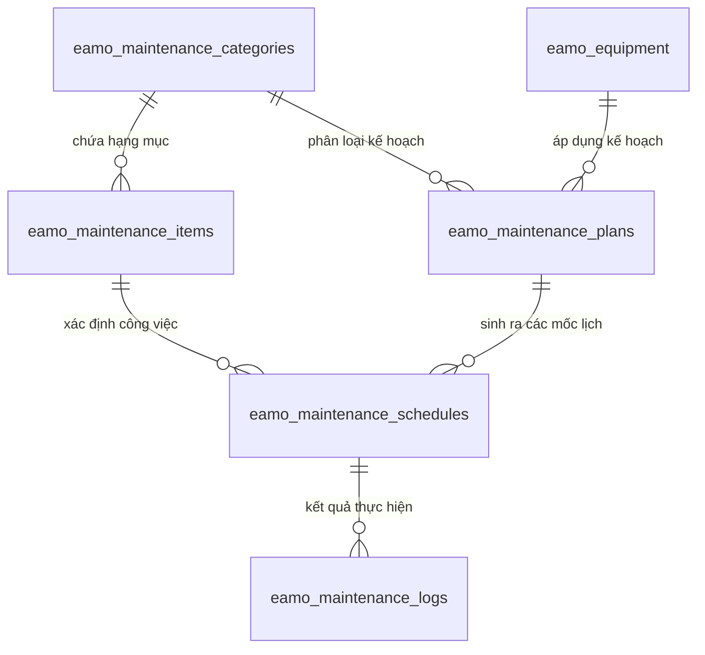

# Tài liệu Luồng Quản lý & Tự Động Sinh Lịch Bảo Trì (Maintenance Management)

Tài liệu này mô tả chi tiết kiến trúc dữ liệu, các mối quan hệ thực thể, thuật toán tự động sinh lịch bảo trì định kỳ (`MaintenanceScheduleGeneratorService`), cơ chế bảo vệ dữ liệu lịch sử và các API điều khiển mô-đun Bảo trì trong hệ thống EAMO.

---

## 1. Mối Quan Hệ Giữa Các Bảng (Database Architecture & ERD)

Mô-đun bảo trì được quản lý dựa trên các thực thể sau:

### 1.1. Chi tiết các bảng
- **`eamo_maintenance_categories` (`MaintenanceCategory`)**: Danh mục phân loại nhóm công việc bảo trì (VD: *"Bảo trì hệ thống điện"*, *"Bảo trì cơ khí"*).
- **`eamo_maintenance_items` (`MaintenanceItem`)**: Hạng mục bảo trì cụ thể thuộc danh mục (VD: *"Thay dầu nhớt"*, *"Kiểm tra dây curoa"*).
- **`eamo_maintenance_plans` (`MaintenancePlan`)**: Kế hoạch bảo trì thiết bị. Lưu trữ ngày bắt đầu (`date`), loại chu kỳ (`cycle_type`), khoảng lặp (`cycle_interval`), và số lần lặp (`occurrences`).
- **`eamo_maintenance_schedules` (`MaintenanceSchedule`)**: Bản ghi lịch bảo trì thực tế theo từng mốc ngày cho từng hạng mục công việc.
- **`eamo_maintenance_logs` (`MaintenanceLog`)**: Nhật ký ghi nhận kết quả bảo trì thực tế (`result`, `note`, `log_date`).

### 1.2. Sơ đồ Quan hệ Thực thể (ERD)



---

## 2. Thuật Toán Tự Động Sinh Lịch Bảo Trì (`MaintenanceScheduleGeneratorService`)

Khi người dùng quản lý kế hoạch bảo trì, thay vì phải tạo thủ công từng mốc công việc, hệ thống **tự động sinh ra toàn bộ lịch bảo trì** dựa trên thông tin cấu hình của Kế hoạch.

### 2.1. Tính toán danh sách ngày theo chu kỳ (`generateDates`)
Từ ngày bắt đầu (`startDate`), chu kỳ (`cycleType`: `daily`, `weekly`, `monthly`, `yearly`), khoảng cách lặp (`cycleInterval`) và số lần lặp (`occurrences`):

$$\text{Mốc ngày thứ } i = \text{startDate} + (i \times \text{cycleInterval} \times \text{Đơn vị chu kỳ}) \quad (i = 0, 1, \dots, \text{occurrences} - 1)$$

```php
public function generateDates(
    CarbonImmutable $startDate,
    string $cycleType,
    int $cycleInterval,
    int $occurrences
): array {
    $dates = [];
    for ($i = 0; $i < $occurrences; $i++) {
        $step = $i * $cycleInterval;
        $dates[] = match ($cycleType) {
            'daily' => $startDate->addDays($step),
            'weekly' => $startDate->addWeeks($step),
            'monthly' => $startDate->addMonths($step),
            'yearly' => $startDate->addYears($step),
            default => throw new \InvalidArgumentException("Invalid cycle type: {$cycleType}"),
        };
    }

    return $dates;
}
```

### 2.2. Giới hạn An Toàn Số lượng Schedules (`MAX_SCHEDULES = 100`)
Số lượng lịch bảo trì tạo ra được tính theo công thức:
$$\text{Tổng số schedules} = \text{occurrences} \times \text{Số lượng hạng mục (items) thuộc Category}$$

Nếu tích này vượt quá **100** (`self::MAX_SCHEDULES`), hệ thống sẽ ném lỗi `ValidationException` để ngăn chặn việc tràn bộ nhớ cơ sở dữ liệu.

### 2.3. Quy trình Sinh mới (`generateForPlan`)
Khi tạo mới Plan (`StoreMaintenancePlanAction`):
1. Lấy danh sách các `MaintenanceItem` thuộc `maintenance_category_id`.
2. Kiểm tra giới hạn `occurrences * itemsCount <= 100`.
3. Sinh danh sách ngày theo chu kỳ.
4. Với mỗi mốc ngày $\times$ mỗi hạng mục $\rightarrow$ Tạo 1 bản ghi `MaintenanceSchedule` (với `original_date = date`, `is_rescheduled = false`).
5. Gán kỹ sư phụ trách từ hạng mục sang lịch bảo trì và phát thông báo.

### 2.4. Cơ chế Bảo vệ Lịch sử khi Cập nhật Plan (`regenerateForPlan`)
Khi sửa đổi Kế hoạch bảo trì (`UpdateMaintenancePlanAction`):
1. **Lọc danh sách Schedule được bảo vệ (Protected IDs)**:
   - Các lịch bảo trì **đã có log thực hiện** (`MaintenanceLog`).
   - Các lịch bảo trì **đã được dời lịch thủ công** (`is_rescheduled = true`).
2. **Dọn dẹp**:
   - Xóa các schedule của các hạng mục bị loại khỏi Category.
   - Nếu các trường chu kỳ (`cycle_type`, `cycle_interval`, `occurrences`, `date`) bị thay đổi, xóa toàn bộ các schedule chưa có log và chưa dời lịch.
3. **Sinh bổ sung**: Tạo mới các mốc schedule cho ngày/hạng mục còn thiếu.

---

## 3. Hoàn Thành Lịch Bảo Trì (`CompleteMaintenanceScheduleAction`)

- **API**: `POST /api/v1/maintenance-schedules/{id}/complete`
- **Quyền**: `engineer`
- **Nghiệp vụ**:
  1. Kỹ sư gửi kết quả thực hiện bảo trì (`result`, `note`, `log_date`).
  2. Hệ thống ghi nhận dữ liệu vào bảng `eamo_maintenance_logs`.
  3. Cập nhật mốc `last_maintenance` trên thiết bị tương ứng.

---

## 4. Danh Sách Endpoints API Bảo Trì

| Method | Endpoint | Middleware | Mô tả |
|---|---|---|---|
| GET | `/api/v1/maintenance-plans` | `engineer` | Danh sách kế hoạch bảo trì |
| GET | `/api/v1/maintenance-plans/{id}` | `engineer` | Chi tiết kế hoạch bảo trì |
| GET | `/api/v1/maintenance-schedules` | `engineer` | Danh sách lịch bảo trì |
| GET | `/api/v1/maintenance-logs` | `engineer` | Nhật ký lịch sử bảo trì |
| GET | `/api/v1/maintenance-categories` | `engineer` | Danh mục bảo trì |
| GET | `/api/v1/maintenance-items` | `engineer` | Hạng mục bảo trì |
| POST | `/api/v1/maintenance-schedules/{id}/complete` | `engineer` | Hoàn thành 1 lịch bảo trì |
| POST | `/api/v1/maintenance-plans` | `manager` | Tạo mới kế hoạch bảo trì (tự động sinh lịch) |
| PUT | `/api/v1/maintenance-plans/{id}` | `manager` | Cập nhật kế hoạch bảo trì (tự động cập nhật lịch) |
| DELETE | `/api/v1/maintenance-plans/{id}` | `manager` | Xóa kế hoạch bảo trì |
| PUT | `/api/v1/maintenance-schedules/{id}` | `manager` | Cập nhật lịch bảo trì thủ công (đổi ngày) |
| DELETE | `/api/v1/maintenance-schedules/{id}` | `manager` | Xóa lịch bảo trì |
| POST | `/api/v1/maintenance-logs` | `manager` | Thêm nhật ký bảo trì thủ công |
| PUT | `/api/v1/maintenance-logs/{id}` | `manager` | Cập nhật nhật ký bảo trì |
| DELETE | `/api/v1/maintenance-logs/{id}` | `manager` | Xóa nhật ký bảo trì |
| POST | `/api/v1/maintenance-categories` | `manager` | Quản lý danh mục bảo trì |
| POST | `/api/v1/maintenance-items` | `manager` | Quản lý hạng mục bảo trì |
